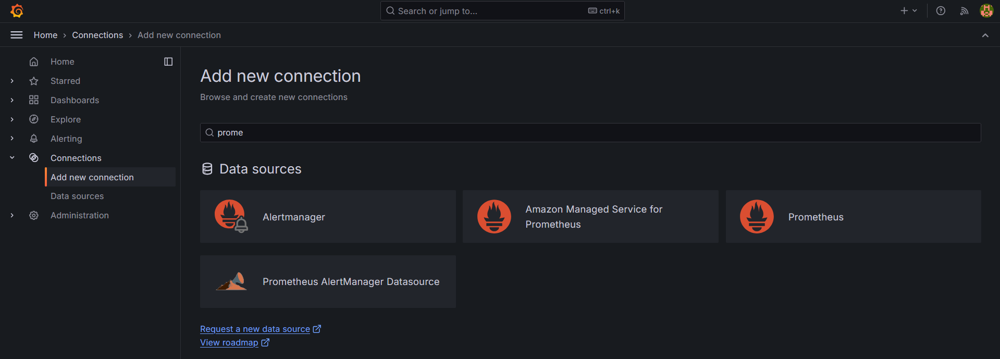
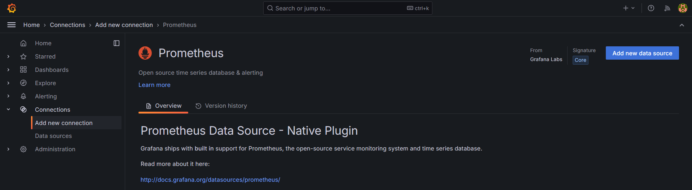
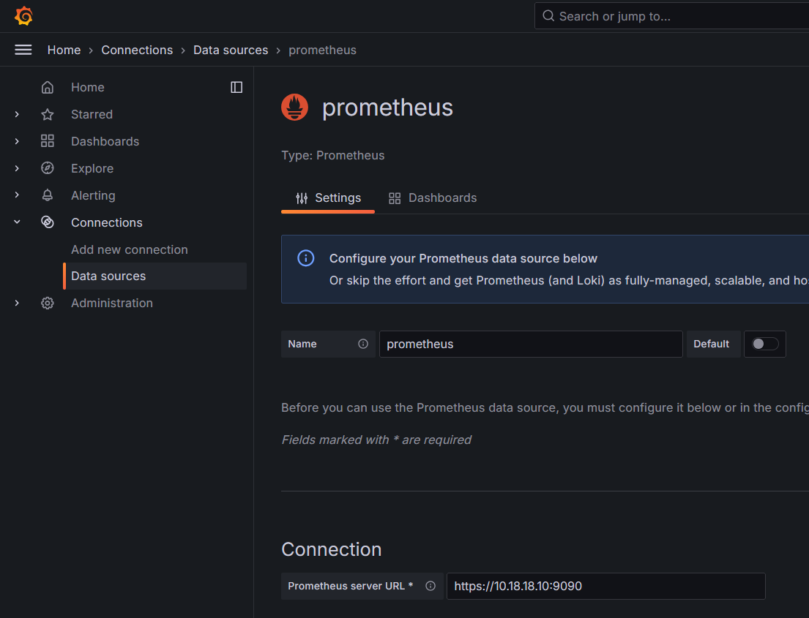
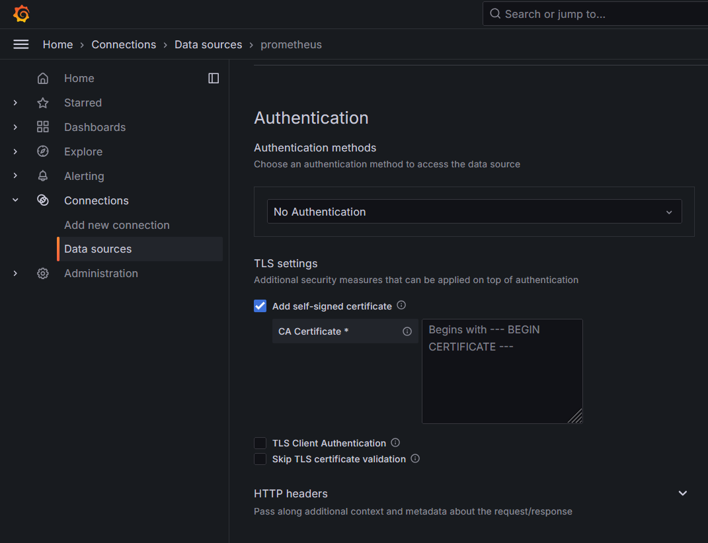
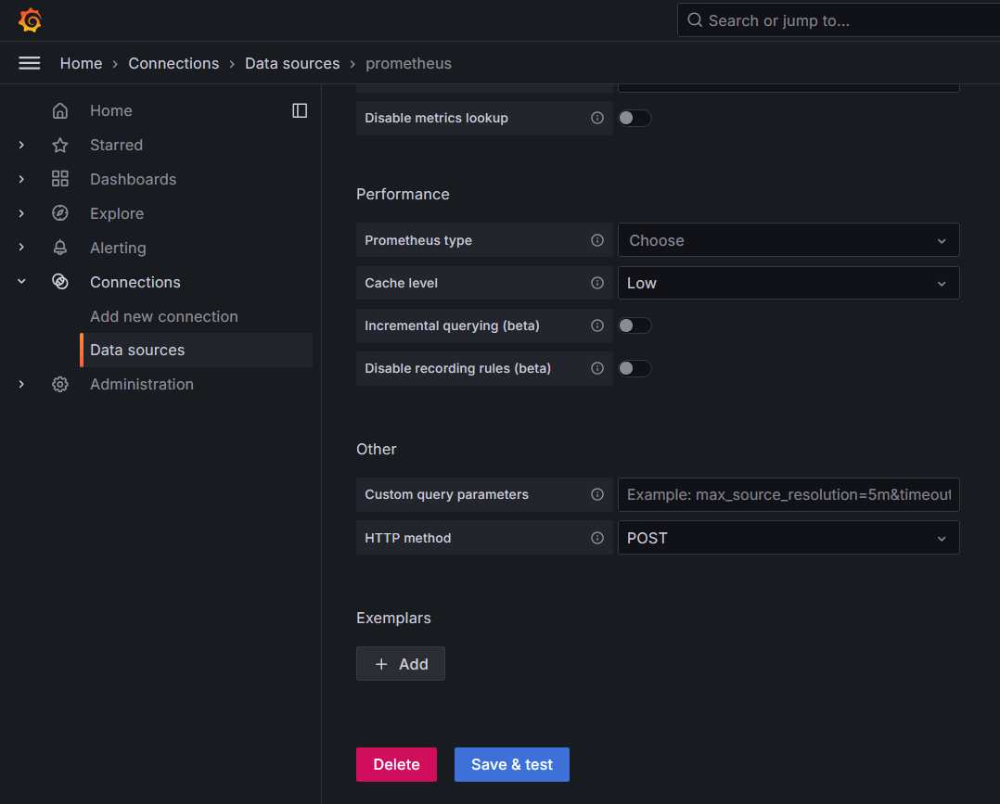

Grafana merupakan salah satu tools berbasis Web untuk data analitik dan data visualisasi yang interaktif dan real time, dengan kemampuan integrasi ke banyak tools lain, seperti prometheus, Loki Promtail, AWS IoT SiteWise, Apache Cassandra dan banyak lagi. Dengan kemampuannya tersebut membuat Grafana lebih fleksible, tidak hanya untuk satu atau dua tools saja. Grafana sendiri open source dan dikembangkan oleh Torkel Ödegaard pada tahun 2014, Grafana awalnya fokus pada integrasi dengan platform monitoring seperti InfluxDB, Graphite, dan Prometheus. Namun, seiring berkembangnya teknologi, Grafana kini mendukung lebih banyak data source, termasuk Elasticsearch, MySQL, PostgreSQL, dan layanan cloud seperti AWS CloudWatch atau Google Cloud Monitoring.

### Fitur Utama Grafana

- **Dashboard Interaktif**: Grafana memungkinkan pengguna membuat dashboard interaktif yang berisi berbagai jenis visualisasi, seperti grafik, tabel, heatmaps, dan lainnya.
- **Mendukung Berbagai Data Source**: Grafana dapat terhubung dengan banyak sumber data sekaligus, memungkinkan integrasi data dari berbagai sistem.
- **Alerting System**: Fitur notifikasi berbasis metrik memungkinkan pengguna menerima peringatan melalui email, Slack, atau layanan lainnya ketika metrik tertentu memenuhi kondisi tertentu.
- **Fleksibilitas Kustomisasi**: Pengguna dapat memodifikasi tampilan, query, hingga gaya visual sesuai kebutuhan.
- **Plugin Ekstensi**: Grafana mendukung plugin pihak ketiga untuk menambah fungsionalitas, seperti visualisasi tambahan atau integrasi data source lainnya.

### Install Grafana With Connect Prometheus SSL

- Download Package Grafana, lalu pindahkan ke **_/etc_**.

  ```bash
  sudo su
  wget https://dl.grafana.com/oss/release/grafana-11.2.2.linux-amd64.tar.gz
  tar -zxvf grafana-v11.2.2.linux-amd64.tar.gz
  cp grafana-v11.2.2.linux-amd64/etc/grafana
  ```

  ---
- Lalu buat service, agar dapat berjalan di background.

  ```bash
  sudo nano /etc/systemd/system/grafana.service
  ```

  ```bash
  [Unit]
  Description=Grafana
  
  [Service]
  User=root
  ExecStart=/etc/grafana/bin/grafana-server -homepath /etc/grafana/ web
  
  [Install]
  WantedBy=default.target
  ```
  
  ---
- Restart Daemon dan jalankan Service Prometheus nya.

  ```bash
  sudo systemctl daemon-reload
  sudo systemctl start grafana.service
  sudo systemctl enable grafana.service
  sudo systemctl status grafana.service
  ```
  
  ---
- Lalu konfigurasi agar Grafana dapat membaca data dari Prometheus. Ke bagiankiri pilih **_“Connections”_**  kemudian **_“Add new connection”_** , lalu pilihData Source **_“Prometheus”_**.
  

  ---
- Klik **_“Add new data source”_** di kanan atas.
  
  
  ---
- Kemudian isi nama **_“Data Source”_** dan **_“Connection – Prometheus serverURL”_**. Kalau Prometheus tidak menggunakan TLS/SSL bisa pakai **_"http"_**biasa.
  
  
  ---
- Lalu checklist di bagian **_“TLS settings – Add self-signed certificate”_**,lalu masukan certificate SSL dari Prometheus nya (file dengan akhiran **_“.crt_**). Kalau Prometheus tidak menggunakan TLS/SSL bisa skip untuk langkah ini.
  
  
  ---
- Kemudian klik **_“Save & Test”_**.
  
  
  ---
  