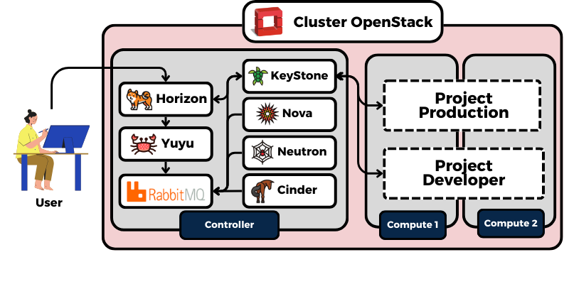

Perusahaan pada zaman modern saat ini telah mengimplementasikan private cloud menggunakan OpenStack untuk mengelola infrastruktur TI secara lebih fleksibel dan efisien. Namun, dalam operasional sehari-hari, tantangan sering muncul terkait dengan pengelolaan sumber daya dan meminimalkan risiko human error, terutama ketika pengembang melakukan pengujian pada lingkungan yang sama dengan produksi. Risiko ini dapat mengganggu stabilitas sistem dan mengakibatkan pemanfaatan resource cloud tidak efisiensi. Untuk mengatasi tantangan tersebut, manajer tim operasional berencana untuk memisahkan lingkungan antara project developer dan production. 

Selain itu, perusahaan ingin memantau dan menghitung penggunaan resource secara terukur menggunakan Yuyu, sebuah solusi untuk pencatatan dan perhitungan pemakaian resource OpenStack dengan integrasi Yuyu, karena dapat melacak penggunaan sumber daya mulai dari volume, flavor, image, dan lain – lain, bahkan sampai router pada OpenStack yang digunakan. Serta dapat menganalisa biaya penggunaan agar dapat menghemat pengeluaran operasional perusahaan.

### Tools yang digunakan :
- **OpenStack– Antelope – v2023.1**
- **Kolla Ansible – v2023.1**
- **Ansible – v2.14.18**
- **Horizon – v2023.1**
- **Yuyu – v2023.1**
- **Python – 3.10.12**

## Topologi



## Langkah Implementasi
### 1. Konfigurasi SSL Certificate untuk service Horizon dan Yuyu.
- Buat file IP SAN untuk Node Controller karena Service Horizon dan Yuyu berada pada Node Controller.
  ```bash
  sudo nano /etc/ssl/IP_SANS.txt
  ```
  ```bash
  subjectAltName=IP:<IP Server / Node>
  ```
  ---
- Buat directory untuk menyimpan Certificate di dalam directory **_“/etc/ssl/”_** agar lebih rapi serta mudah di identifikasi.
  ```bash
  ~$ sudo mkdir -p /etc/ssl/
  ~$ sudo mkdir -p /etc/ssl/
  ```
  ---
- Buat certificate untuk service Horizon dan Yuyu
  - Horizon
    
    ```bash
    sudo openssl genrsa -out /etc/ssl/horizon/horizon.key 2048
    
    sudo openssl req -sha512 -new \
      -subj "/C=IN/ST=jateng/L=kendal/0=Horizon Najwan/OU=Horizon Najwan/CN=Horizon Najwan>" \
      -key /etc/ssl/horizon/horizon.key \
      -out /etc/ssl/horizon/horizon.csr
    
    sudo openssl x509 -req -sha512 -days 3650 \
      -key /etc/ssl/horizon/horizon.key \
      -extfile /etc/ssl/IP_SANS.txt \
      -in /etc/ssl/horizon/horizon.csr\
      -out /etc/ssl/horizon/horizon.crt
    ```
    ---
  - Yuyu
    ```bash
    sudo openssl genrsa -out /etc/ssl/yuyu/yuyu.key 2048
    
    sudo openssl req -sha512 -new \
      -subj "/C=IN/ST=jateng/L=kendal/0=Yuyu Najwan/OU=Yuyu Najwan/CN=Yuyu Najwan>" \
      -key /etc/ssl/yuyu/yuyu.key \
      -out /etc/ssl/yuyu/yuyu.csr
    
    sudo openssl x509 -req -sha512 -days 3650 \
      -key /etc/ssl/yuyu/yuyu.key \
      -extfile /etc/ssl/IP_SANS.txt \
      -in /etc/ssl/yuyu/yuyu.csr\
      -out /etc/ssl/yuyu/yuyu.crt
    ```
    ---
- Kemudian pindahkan file certificate (dengan format .crt ) yang sudah dibuat tadi, agar certificate nya di akui oleh system operasi ubuntu, agar tidak menjadi certificate self-signed. Karena untuk Django di Horizon perlu di buat seperti itu.
  ```bash
  ~$ sudo apt-get install ca-certificates
  ~$ sudo cp /etc/ssl/horizon/horizon.crt /usr/local/share/ca-certificates
  ~$ sudo cp /etc/ssl/yuyu/yuyu.crt /usr/local/share/ca-certificates

  ~$ sudo update-ca-certificates
  ```
---
### 2. Install OpenStack dengan Kolla-Ansible
OpenStack terdiri dari beberapa service, yang nantinya berinteraksi satu sama dengan API dari setiap service yang ada, untuk service nya sendiri itu adalah sebagai berikut :
- **Keystone**, untuk identity service (verifikasi akses).
- **Neutron**, untuk Networking OpenStack.
- **Nova**, untuk Compute Service (yang Membuat Instance).
- **Glance**, untuk menyimpan Image yang digunakan untuk membuat Instance.
- **Cinder**, untuk membuat Volume yang digunakan Instance
- **RabbitMQ**, untuk Message Broker yang mengirim event dari komponen OpenStack.
Untuk lebih detail terkait Penjelasan dan Installasi nya bisa ke Post saya yang [OpenStack](https://vianaja.github.io/blog-najwan/2024-10-19-openstack/).
- Edit pada file global.yaml untuk opsi
  ```yaml
  kolla_enable_tls_internal: "yes"
  kolla_certificates_dir: "{{ node_config }}/certificates"
  kolla_admin_openrc_cacert: "/etc/kolla/certificates/ca/root.crt"
  kolla_copy_ca_into_containers: "yes"
  kolla_enable_tls_backend: "yes"
  kolla_verify_tls_backend: "no"
  kolla_tls_backend_cert: "{{ kolla_certificates_dir}}/backend-cert.pem"
  kolla_tls_backend_key: "{{ kolla_certificates_dir}}/backend-key.pem"
  ```
  ---
- lalu pada step sebelum deploy, jalankan perintah ini untuk membuat Certificate.
  ```bash
  (kolla-venv) student@controller:~$ kolla-ansible -i ./multinode certificates
  ```
  ---
### 3. Konfigurasi dan Installasi Horizon
- Install dependencies yang dibutuhkan, dan clone repository atau ambil source code dari horizonnya.
- 


