[//]: # (Dalam era DevOps dan automasi modern, integrasi antara sistem kontrol versi seperti GitLab dengan platform orkestrasi container seperti Kubernetes menjadi kebutuhan utama. Banyak perusahaan dan tim pengembang mencari solusi yang dapat mempercepat proses build, testing, dan deployment secara otomatis ke dalam lingkungan Kubernetes. Melalui project ini, saya mengeksplorasi bagaimana GitLab Kubernetes Agent dan GitLab Runner dapat bekerja sama untuk menciptakan pipeline CI/CD yang aman, efisien, dan sepenuhnya terintegrasi dengan cluster Kubernetes.)

Dalam praktik modern pengembangan perangkat lunak, automasi deployment ke lingkungan produksi menjadi salah satu prioritas utama. Penggunaan GitLab sebagai platform DevOps all-in-one dan Kubernetes sebagai orkestrator container telah menjadi kombinasi yang sangat umum di berbagai organisasi. Namun, integrasi antara keduanya seringkali menghadirkan tantangan tersendiri, terutama dalam hal keamanan dan manajemen akses.

Untuk menjawab kebutuhan tersebut, GitLab menyediakan solusi bernama GitLab Kubernetes Agent (KAS), sebuah mekanisme komunikasi terenkripsi yang memungkinkan GitLab terhubung secara aman dan efisien ke cluster Kubernetes, tanpa perlu menyimpan kubeconfig atau token di dalam repository CI/CD.

**Apa itu GitLab Kubernetes Agent?**
GitLab Kubernetes Agent adalah komponen yang berjalan di dalam cluster Kubernetes dan bertugas membangun koneksi dua arah yang terenkripsi dengan server GitLab melalui Kubernetes Agent Server (KAS). Mekanisme ini memungkinkan berbagai fitur seperti:

- Deployment otomatis dari pipeline GitLab ke cluster Kubernetes
- Sinkronisasi GitOps menggunakan pull-based approach, yang dimana nanti dari si Agent yang ada di kubenetes akan pull / mengambil data yang ada di repositori GitLab, lalu di apply.
- Manajemen akses yang lebih fleksibel, aman dan terpusat hanya di GitLab dan Kubernetesnya saja.

**Arsitektur KAS Secara Singkat**
- GitLab Kubernetes Agent (gitlab-agent) dideploy sebagai pod di dalam cluster Kubernetes.
- Kubernetes Agent Server (KAS) merupakan komponen server yang dijalankan oleh GitLab.
- Kemudian komunikasi antara gitlab-agent dan KAS menggunakan gRPC (Google Remote Procedure Call) untuk memastikan keamanan dan integritas data.

#### Kelebihan

- Keamanan lebih tinggi, karena tidak perlu expose API server ke luar dan hanya membuat sebuah tunnel untuk komunikasi antara gitlab-agent dan KAS.
- Semua ada pada GitLab, jadi tidak perlu tools tambahan lain seperti Flux atau ArgoCD dll.
- Access Control terpusat, karena hanya menggunakan RBAC dari GitLab dan Kubernetes nya saja.
- Cukup mudah konfigurasinya, karena tidak perlu tambahan tools lain, jadi hanya fokus ke GitLab dan Kubernetesnya saja jadi tidak ada konfigurasi tambahan.

#### Kekurangan
- Keterbatasan fitur GitOps, karena tanpa menggunakan tools lain seperti Flux atau ArgoCD, jadi fitur yang dimiliki cukup terbatas, tidak se-fleksible Flux/ArgoCD.
- Ketergantungan pada GitLab, karena si agent nya ini hanya dapat bekerja di ekosistem GitLab saja.
- Konfigurasi Awal cukup ribet, harus benar - benar mengetahui terkait GitLab dan Kubernetes cukup dalam, karena hanya berfokus pada 2 tools itu.
- Komunitas yang lebih sempit, tidak seperti Flux / ArgoCD yang sudah ada komunitas yang cukup besar.

### Topologi
  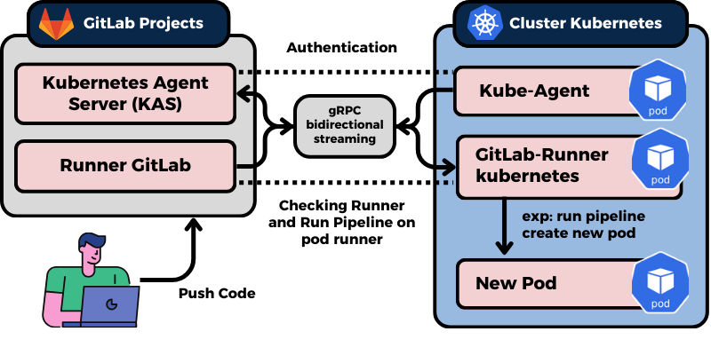

**Penjelasan :**
Jadi nantinya saat user push code ke project/repositori GitLab, akan mentrigger CI/CD pipeline yang dimana sebelumnya sudah melakukan autentikasi dari gitlab-agent ke KAS nya, lalu setelah itu GitLab-Runner kubernetes akan menjalankan pipeline sesuai yang ada di file _**".gitlab-ci.yaml"**_, misal membuat pod baru, atau hanya mengecek pod yang ada apa saja, dan masih banyak lagi.


### Tools yang digunakan
- **Kubernetes Cluster**
- **GitLab Project**
- **Helm**
- **glab**
- **Docker**

### Implementasi

#### 1. Create Cluster Kubernetes

Untuk pembuatan Cluster Kubernetes multinode bisa cek pada postingan saya yang ini [Kubernetes](https://vianaja.github.io/blog-najwan/2024-11-2-kubernetes/) untuk lebih detail terkait Create Cluster Kubernetes Multinode. Untuk case saat ini saya menggunakan deployment dengan menggunakan **minikube** karena saya ingin menggunakan kubernetes di single node dengan spesifikasi yang tergolong rendah bisa pakai ini, untuk cara configurasinya bisa lihat di dokumentasi resmi dari [minikube](https://minikube.sigs.k8s.io/docs/start/). Kurang lebihnya sama saja antara single node dan multinode

#### 2. Buat Project GitLab dan buat Kube agent di projectnya
- Akses GitLab dashboard nya, lalu klik di bagian _**"New project"**_ untuk membuat project baru.
  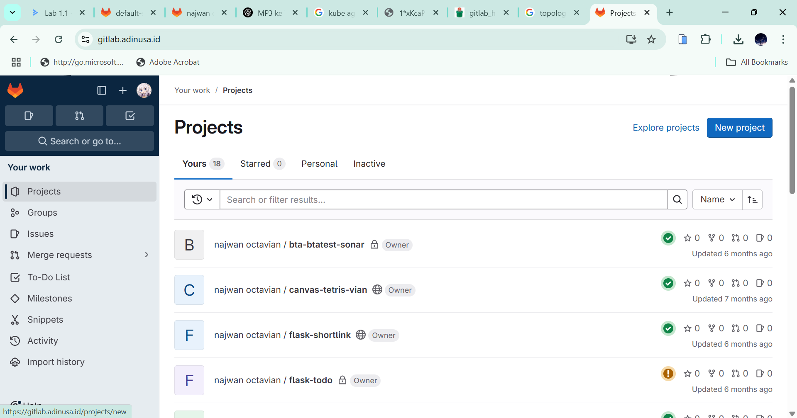
---
- Lalu klik yang _**"Create blank project"**_ untuk membuat project baru yang masih kosong.
  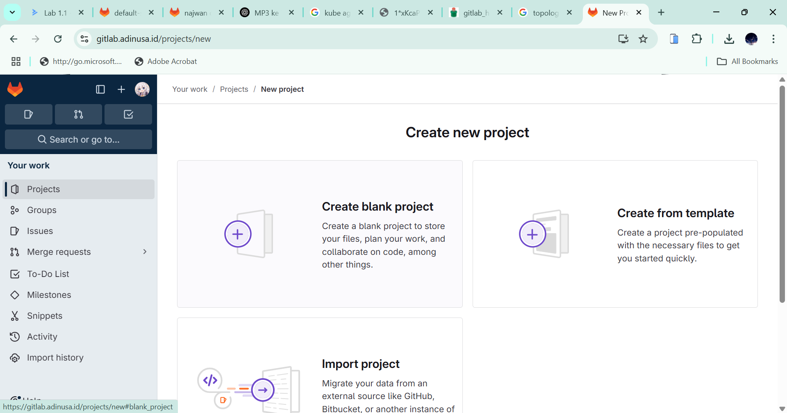
---

- Lalu isikan nama dari project nya. Misal sebagai contoh _**kubernetes-agent**_.
  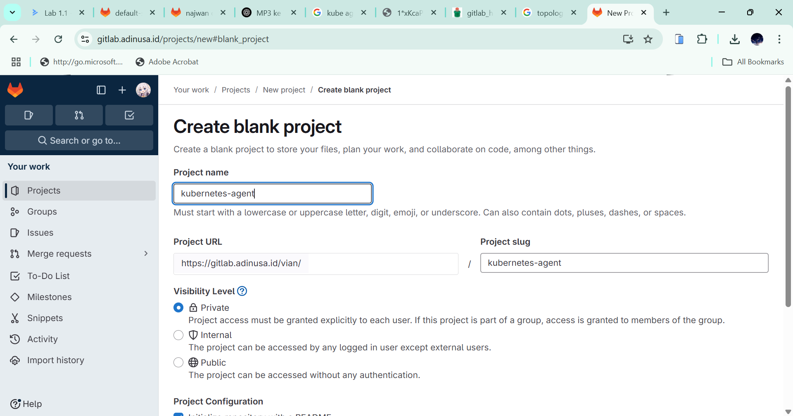
---

- Lalu sesuaikan _**Visibility Level**_ nya. Apakah project ini ingin dapat di lihat oleh orang lain (public) atau tidak (private). Setelah nya klik _**"Create project"**_ untuk membuat project barunya.
  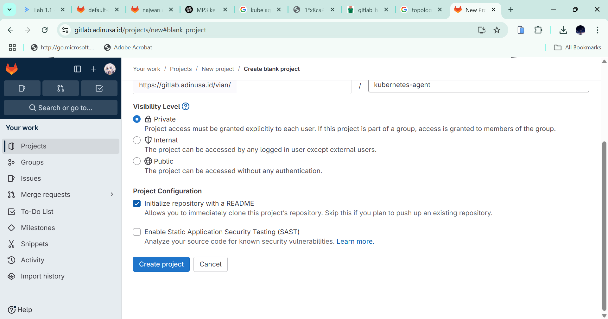
---

##### Buat Kube Agent di Project GitLab

- Klik pada _**Operate -> Kubernetes cluster**_ 
  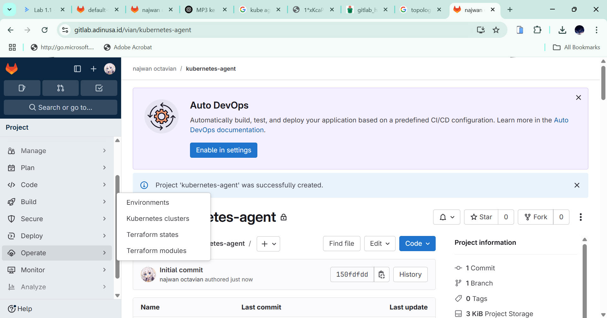
---

- Lalu klik _**"Connect a cluster"**_ untuk membuat koneksi kubernetes clusternya dari GitLab.
  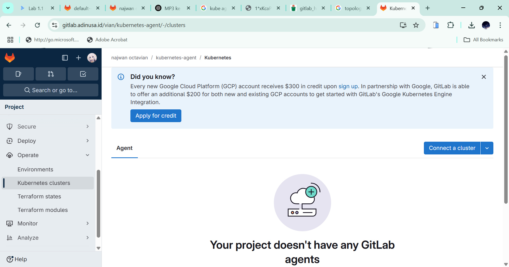
---

- Selanjutnya pilih _**"Option 2"**_, isi bagian nama nya, sebagai contoh misal saya beri nama _**kube-agent**_.
  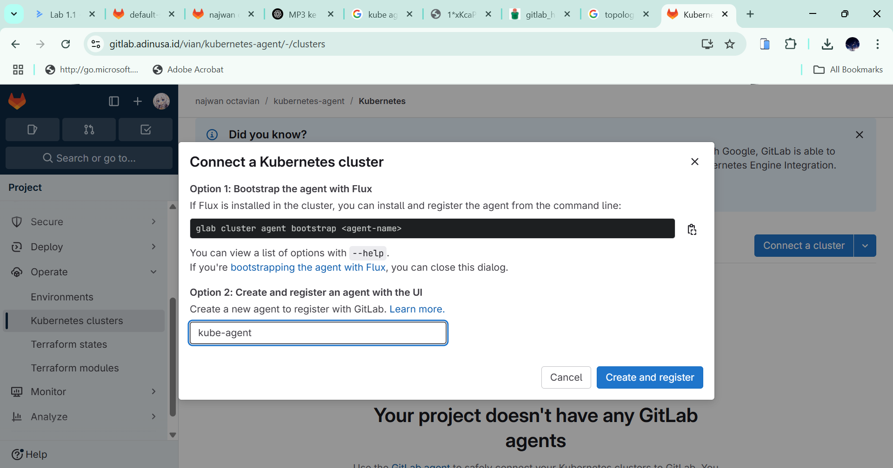
---

- Lalu setelahnya akan ada _**"Agent access token"**_, simpan token tersebut karena akan digunakan untuk mengakses cluster kubernetesnya.
  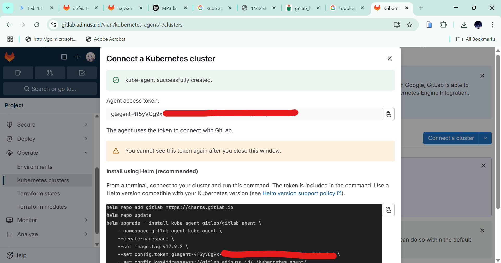
---

- Lalu setelah selesai, buat folder pada project nya ini. Untuk path nya sendiri sesuai yang ada di kotak merah yang paling kecil yaitu _**".gitlab/agent/<name-cluster>/config.yaml"**_, ini bisa berbeda sesuai penamaan dari cluster yang sebelumnya.
  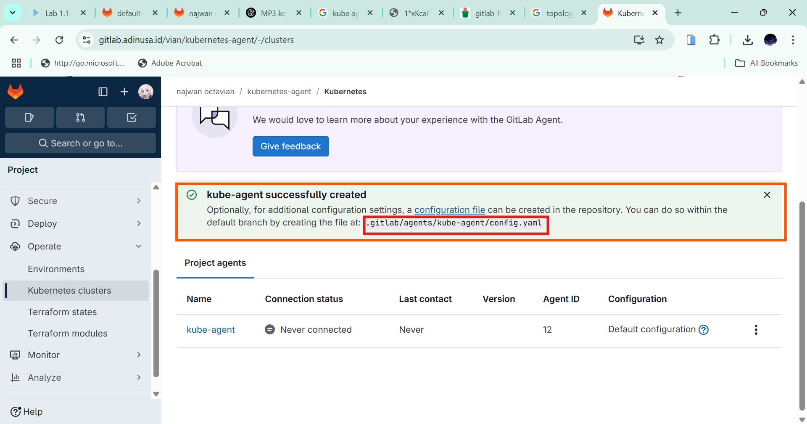
---

- Untuk isi dari file config.yaml nya adalah seperti berikut ini :
  - _**"user_access"**_ itu mengatur akses user dari GitLab yang akan mengakses Kubernetes.
  -  _**"agent: {}"**_, itu arti nya tidak di batasi role apapun, jadi setara dengan admin (full access).
  -  _**"project"**_ lalu _**"- id"**_, hanya mengatur untuk project yang digunakan saja, bisa sesuaikan sendiri untuk nama project nya ini.
  -  _**"ci_access"**_ itu mengatur akses CI/CD Pipelinenya.
  -  _**"project"**_ lalu _**"- id"**_ yang ke dua kurnag lebih sama, hanya mengatur untuk project yang digunakan saja.
  -  _**"default_namespace"**_, mengatur namespace mana yang mau digunakan, bisa sesuaikan saja.
  
  ```yaml
  user_access:
    access_as:
        agent: {}
    projects:
        - id: vian/kube-agent
  ci_access:
    projects:
      - id: vian/kube-agent
        default_namespace: gitlab-agent
  ```
  ---


##### Buat Access Token
- Klik di _**Setting -> Access Token**_ di bar samping kiri.
  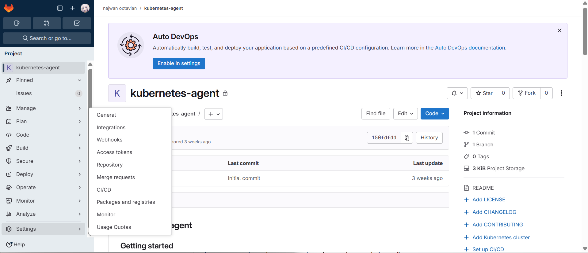
---

- Lalu klik _**"Add new token"**_ untuk membuat access token baru agar dapat login GitLab lewat CLI untuk cluster kubernetesnya.
  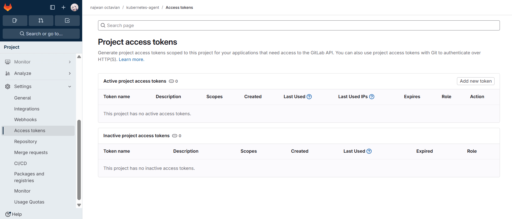
---

- Berikan nama untuk access token nya.
  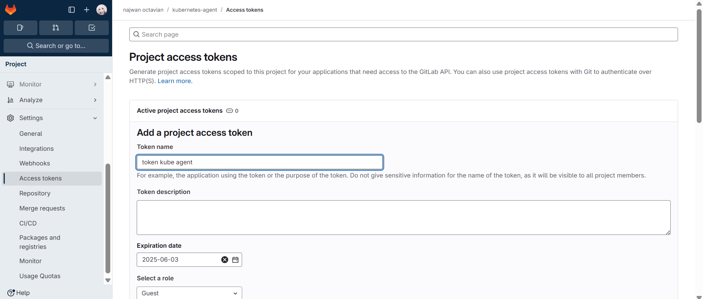
---

- Setelahnya adalah _**"Select scopes"**_ atau akses apa saja yang akan di berikan saat menggunkan credentials token ini, untuk kebutuhannya adalah _**"api"**_ dan _**"write_repository"**_. akan tetapi untuk saya lebih prefer dengan settingan tambahan berikut ini:
  - _**"read_api"**_
  - _**"k8s_proxy"**_
  - _**"read_repository"**_

  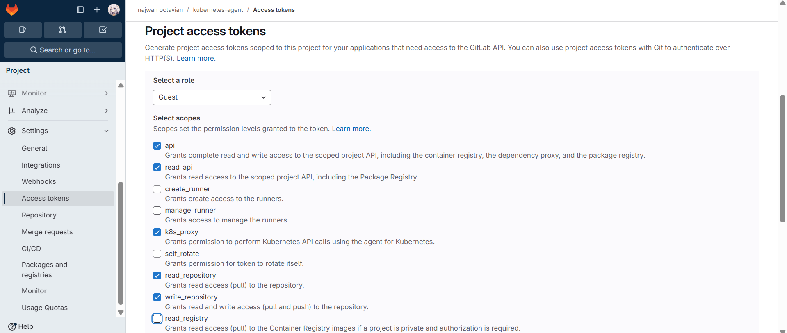
---

- Lalu klik _**"Create project access token"**_.
  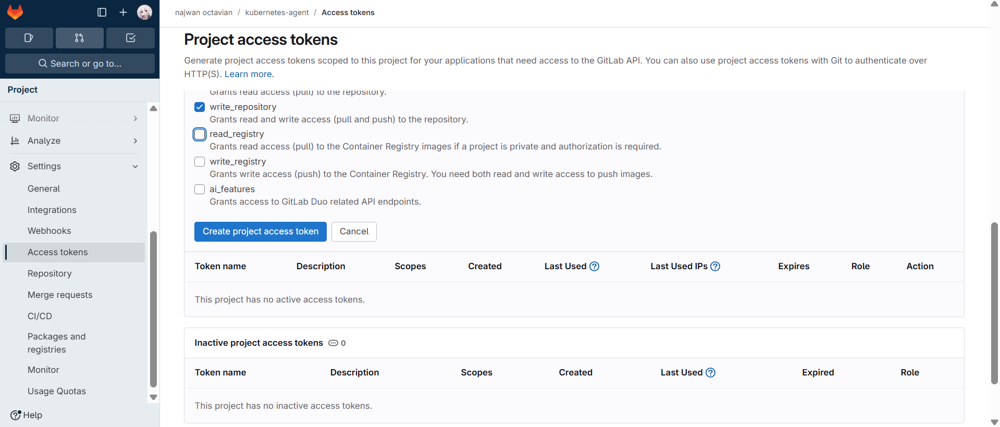
---

- Setalahnya akan di berikan access token nya, copy token tersebut. Karena nanti akan digunakan untuk login GitLab project lewat CLI untuk kubernetesnya.
  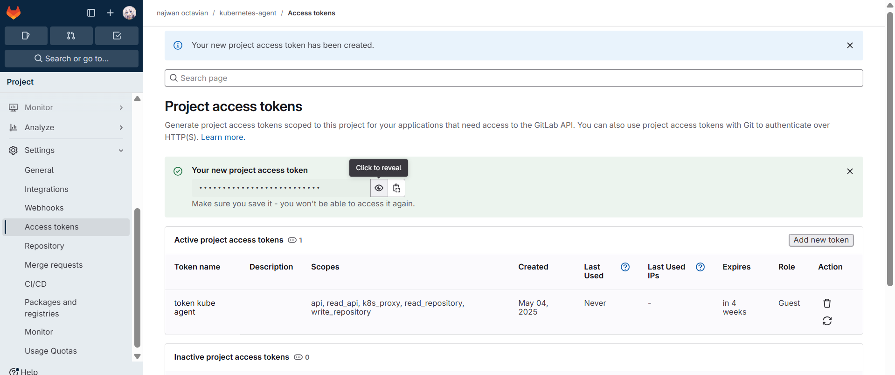
---

#### 3. Login GitLab via terminal/CLI
- Login GitLab via Terminal/CLI, lalu sesuaikan tipe dari Gitlabnya, untuk project saya kali ini saya menggunkan yang **"GitLab Self-hosted Instance"**. Lalu Enter.
  ```bash
  $ glab auth login
  ? What GitLab instance do you want to log into?  [Use arrows to move, type to filter]
    gitlab.com
  > GitLab Self-hosted Instance
  ```
  ---

  - Lalu masukan hostname dari GitLabnya, sebagai contoh saya menggunakan GitLab dari adinusa "gitlab.adinusa.id", kalian bisa sesuaikan masing - masing.
  ```bash
  ? What GitLab instance do you want to log into? GitLab Self-hosted Instance
  ? GitLab hostname: gitlab.adinusa.id
  ```
  ---

  - pilih tipe login nya, bisa pakai Web atau dari Token yang di buat di GitLab nya. untuk ini saya pilih yang "Token".
  ```bash
  ? How would you like to sign in?  [Use arrows to move, type to filter]
  > Token
    Web
  ```
  ---

  - Lalu akan diminta untuk memasukan auth token yang sudah di buat tadi di GitLab, tinggal paste dan enter.
  ```bash
  Tip: generate a Personal Access Token at https://gitlab.adinusa.id/-/profile/personal_access_tokens?scopes=api,write_repository.
  The minimum required scopes are 'api' and 'write_repository'.
  ? Paste your authentication token:
  ```
  ---

  - Lalu pilih protokol yang mau di gunakan, untuk ini saya pilih yang "HTTPS".
  ```bash
  ? Choose default Git protocol:  [Use arrows to move, type to filter]
    SSH
  > HTTPS
    HTTP
  ```
  ---
  - Pilih yang sama juga untuk API nya, yaitu "HTTPS".
  ```bash
  ? Authenticate Git with your GitLab credentials? Yes
  ? Choose host API protocol:  [Use arrows to move, type to filter]
  > HTTPS
    HTTP
  ```
  ---

  - Lalu setelahnya akan muncul seperti ini, yang menandakan bahwa telah login ke GitLab dengan Project yang sebelumnya di buat Token nya juga.
  ```bash
  - glab config set -h gitlab.adinusa.id git_protocol https
  ✓ Configured Git protocol.
  - glab config set -h gitlab.adinusa.id api_protocol https
  ✓ Configured API protocol.
  ✓ Logged in as project_765_bot_ce6b24221b39aa6436b1ca36dc8bfb1c
  ```
  ---


#### 4. Create ServiceAccount Kubernetes

Agar GitLab pipeline CI/CD nantinya dapat akses, melalui ServiceAccount yang di buat ini, yang di bind langsung ke GitLab-Runner, agar mendapat akses. Ada 2 cara yang bisa digunakan.


- Untuk akses ke Namespace tertentu, menggunakan config seperti ini. Ubah di bagian _**"<nama_namespace>"**_ sesuai namespace yang ingin digunakan.
  ```yaml
  apiVersion: v1
  kind: ServiceAccount
  metadata:
    name: gitlab-runner
    namespace: <nama_namespace>
  ---
  apiVersion: rbac.authorization.k8s.io/v1
  kind: Role
  metadata:
    name: gitlab-runner
    namespace: <nama_namespace>
  rules:
    - apiGroups: [""]
      resources: ["pods", "services", "configmaps", "secrets"]
      verbs: ["get", "list", "watch", "create", "update", "delete"]
    - apiGroups: ["apps"]
      resources: ["deployments", "replicasets"]
      verbs: ["get", "list", "watch", "create", "update", "delete"]
    - apiGroups: ["networking.k8s.io"]
      resources: ["ingresses"]
      verbs: ["get", "list", "watch", "create", "update", "delete"]
  ---
  apiVersion: rbac.authorization.k8s.io/v1
  kind: RoleBinding
  metadata:
    name: gitlab-runner-binding
    namespace: <nama_namespace>
  roleRef:
    apiGroup: rbac.authorization.k8s.io
    kind: Role
    name: gitlab-runner
  subjects:
    - kind: ServiceAccount
      name: gitlab-runner
      namespace: <nama_namespace>
  ```
  ---

- Untuk akses semua Namespace atau secara full 1 cluster, menggunakan config seperti ini.
  ```yaml
  apiVersion: v1
  kind: ServiceAccount
  metadata:
    name: gitlab-runner
    namespace: kube-system
  ---
  apiVersion: rbac.authorization.k8s.io/v1
  kind: ClusterRoleBinding
  metadata:
    name: gitlab-runner-binding
  roleRef:
    apiGroup: rbac.authorization.k8s.io
    kind: ClusterRole
    name: cluster-admin
  subjects:
    - kind: ServiceAccount
      name: gitlab-runner
      namespace: kube-system
  ```
  ---


#### 5. Create Kube-Agent dengan helm

- Menambahkan repository helm untuk chart gitlab, serta update repository helmnya.
  ```bash
  helm repo add gitlab https://charts.gitlab.io
  helm repo update
  ```
  ---

- Create Kube-Agent GitLab, dengan ketentuan seperti berikut:
    - Sesuaikan namespace yang ingin di gunakan di _**"--namespace <nama_namespace>"**_. lalu jika namespace nya belum ada, dan ingin di buat otomatis, pakai _**"--create-namespace"**_.
    - Jika ingin menggatur tag image yang berbeda, bisa ubah di bagian _**"--set image.tag="**_.
    - Lalu sesuaikan untuk token untuk connect dari cluster kubenetes ke GitLab di bagian _**--set config.token="**_.
    - Lalu atur kasAddress juga _**"--set config.kasAddress="**_, sesuaikan dengan GitLab yang digunakan.
    - Lalu tambahkan juga untuk ServiceAccount nya di bagian _**"--set serviceAccount.name="**_.
    - Lalu karena sudah di buat untuk ServiceAccount nya, tambahkan _**"--set serviceAccount.create=false"**_ dan _**"--set rbac.create=false"**_ agar tidak membuat RBAC dan ServiceAccount baru, agar menggunakan sesuai yang sudah di setting.
    ---
  sebagai contoh saya menggunakan settingan seperti berikut ini.
  ```bash
  helm upgrade --install test gitlab/gitlab-agent \
    --namespace gitlab-agent \
    --create-namespace \
    --set image.tag=v17.9.2 \
    --set config.token=glagent-GD-********** \
    --set config.kasAddress=wss://gitlab.adinusa.id/-/kubernetes-agent/ \
    --set rbac.create=false \
    --set serviceAccount.name=gitlab-runner \
    --set serviceAccount.create=false 
  ```
  ---

#### 6. Create GitLab-Runner dengan Helm

- Create GitLab-Runner dengan perintah seperti berikut. sesuaikan pada bagian:
  - _**"--namespace"**_ sesuaikan namespace yang akan di tempatkan, misal cohtoh saya di namespace _**"gitlab-runner"**_.
  - _**"--set gitlabUrl="**_ sesuaikan url gitlab yang digunakan, untuk saya kali ini menggunakan _**"https://gitlab.adinusa.id"**_.
  - _**"RUNNER-TOKEN"**_ sesuaikan juga untuk runner token yang sudah di buat melalui dashboard GitLab.
  - Lalu atur juga untuk ServiceAccount yang akan digunakan di bagian _**"--set serviceAccount.name="**_, sebagai contoh saya pakai dengan nama _**"gitlab-runner"**_.
  - Lalu karena sudah di buat untuk ServiceAccount nya, tambahkan _**"--set serviceAccount.create=false"**_ dan _**"--set rbac.create=false"**_ agar tidak membuat RBAC dan ServiceAccount baru, agar menggunakan sesuai yang sudah di setting.
  ---

  Sebagai contoh saya menggunakan settingan seperti berikut ini.                                          
  ```bash
  helm upgrade --install gitlab-runner gitlab/gitlab-runner \
    --namespace gitlab-runner \
    --set gitlabUrl=https://gitlab.adinusa.id \
    --set runnerToken=<RUNNER-TOKEN> \
    --set runners.executor="kubernetes" \
    --set rbac.create=false \
    --set serviceAccount.name=gitlab-runner \
    --set serviceAccount.create=false
  ```
  ---
#### 7. Pengecekan GitLab-Runner
- Mengecek ServiceAccount di pod dengan kubectl. Sesuaikan pada bagian opsi _**"-n "**_ atau namespace nya, karena pasti berbeda beda.
  ```bash
  kubectl get pod -n gitlab-runner -l app=gitlab-runner -o jsonpath="{.items[*].spec.serviceAccountName}"
  ```
  ---

- Mengecek ServiceAccount pada POD melalui Helm manifest. Sesuaikan pada bagian opsi _**"-n "**_ atau namespace nya, karena pasti berbeda beda.
  ```bash
  helm get manifest gitlab-runner -n gitlab-runner | grep serviceAccountName -A 2
  ```
  ---

- Pengujian Akses dengan ServiceAccount yang sudah di buat, pastikan output nya _**"yes"**_ yang menandakan bahwa bisa akses. Sesuaikan pada bagian opsi _**"-n "**_ atau namespace nya, karena pasti berbeda beda.
  ```bash
  kubectl auth can-i get pods --as=system:serviceaccount:gitlab-agent-test:gitlab-runner -n gitlab-runner
  ```
  ---

#### 8. Pengujian Kube-Agent dan GitLab-Runner
- Pengujian menjalankan pipeline sederhana untuk mengecek Pod yang ada dengan script gitlab-ci seperti berikut.
  ```yaml
  deploy:
    stage: deploy
    image: bitnami/kubectl
    script:
      - kubectl get pods -n gitlab-agent-test
    tags: <tags_pada_runner>
  ```
  ---

- Seperti ini nanti jika sudah berhasil menjalankan pipelinenya.
  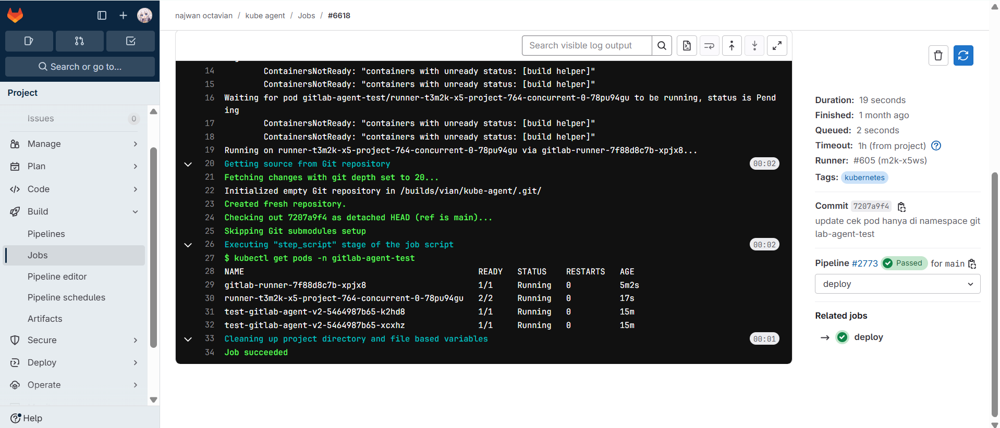


#### Kesimpulan
Integrasi GitLab Kube Agent dengan KAS membawa angin segar bagi pengguna Kubernetes yang menginginkan fleksibilitas tanpa mengorbankan keamanan. Dengan kemampuannya mengelola kluster dalam jaringan terisolasi, melakukan sinkronisasi konfigurasi secara real-time, serta mendukung skenario GitOps yang kompleks, tools ini menegaskan komitmen GitLab dalam menyediakan solusi end-to-end untuk siklus hidup pengembangan perangkat lunak.

Penting untuk diingat bahwa adopsi teknologi cloud-native tidak hanya tentang menggunakan tools terbaru, tetapi juga tentang memilih solusi yang selaras dengan kebutuhan keamanan dan operasional tim. GitLab Kube Agent dan KAS adalah contoh nyata bagaimana kolaborasi antara platform CI/CD dan Kubernetes bisa menghasilkan efisiensi yang lebih baik. Bagi Anda yang belum mencoba, kini saatnya untuk bereksperimen dan melihat bagaimana kombinasi ini dapat mentransformasi alur DevOps di organisasi Anda.