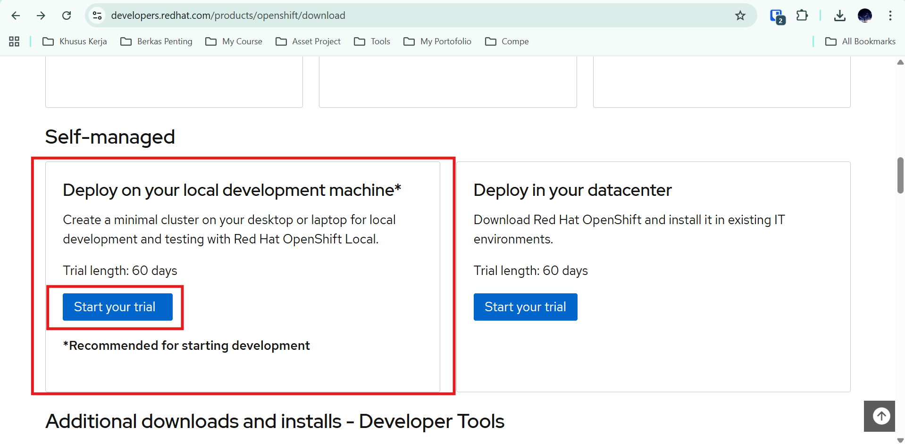
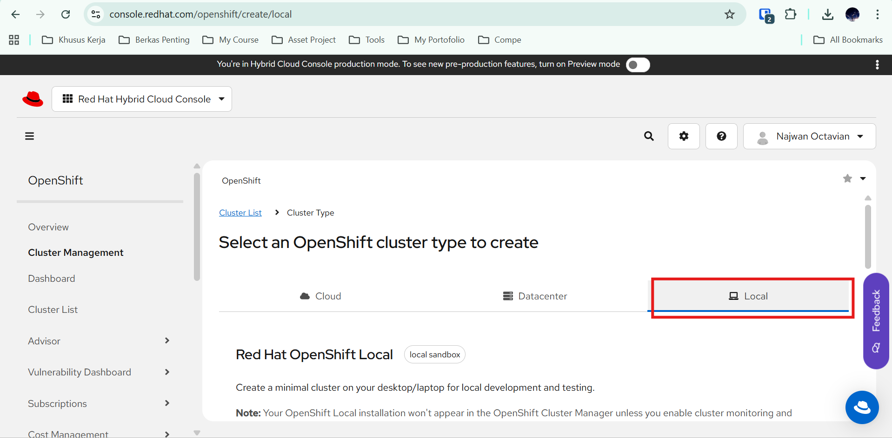
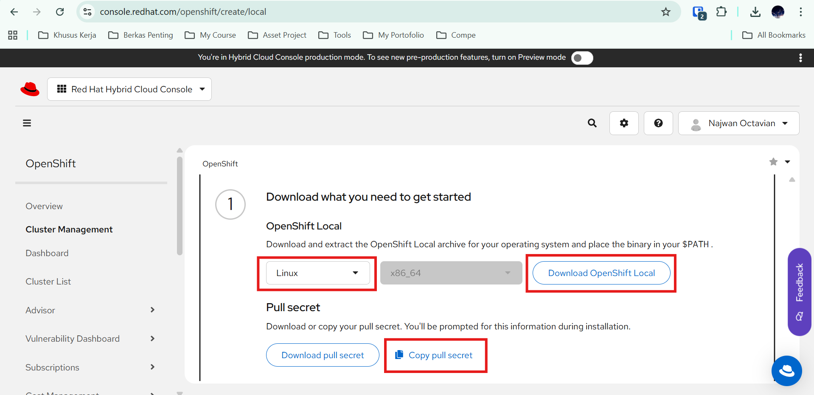
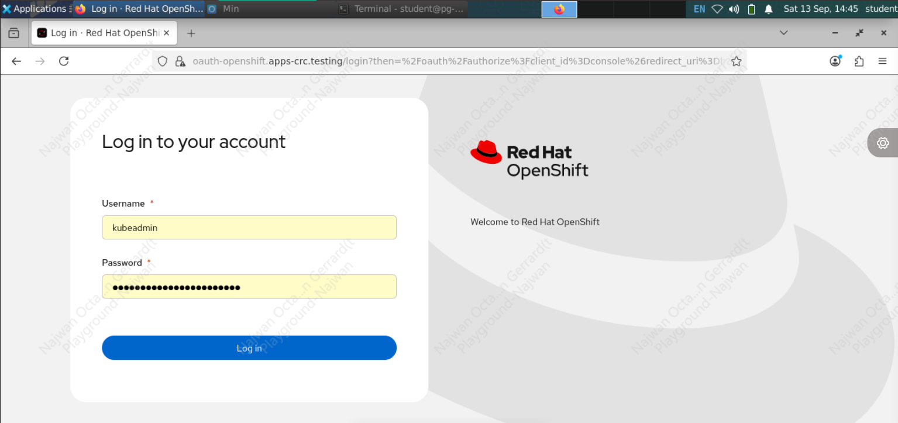
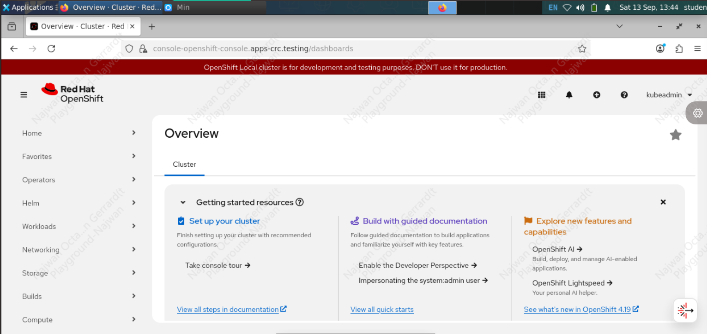

OpenShift merupakan sebuah platform berbasis Kubernetes yang dirancang oleh Red Hat untuk mempermudah perusahaan membangun, menjalankan, dan mengelola aplikasi modern dalam skala besar. Kalau Kubernetes itu ibarat mesin inti untuk mengatur kontainer, maka OpenShift bisa dianggap sebagai “versi enterprise” yang lebih lengkap: ia sudah menambahkan lapisan keamanan, developer tools, pipeline CI/CD, serta integrasi manajemen yang rapi sehingga tim tidak perlu lagi repot menyiapkan semuanya dari nol.


### **Keuntungan OpenShift**

* **Meningkatkan produktivitas developer**

  * Fokus menulis kode, deploy dengan satu perintah
* **Memudahkan admin**

  * Built-in security (RBAC, image scanning, network policies)
  * Monitoring, logging, dan scaling otomatis
* **Fleksibel & tidak terkunci vendor**

  * Bisa di cloud publik, data center sendiri, atau laptop
  * Mendukung hybrid dan multi-cloud
* **Ekosistem lengkap**

  * Katalog bahasa, framework, dan middleware siap pakai
  * Operator Framework untuk otomatisasi aplikasi kompleks

### **Kekurangan OpenShift**

* **Kompleksitas instalasi & operasional**

  * Lebih rumit dibanding Kubernetes vanilla
* **Biaya lisensi**

  * Versi enterprise berbayar (Red Hat subscription)
* **Resource intensif**

  * Membutuhkan hardware/server cukup besar terutama untuk production

Dengan kata lain, OpenShift menawarkan lebih dari sekadar orkestrasi kontainer: ia memberikan platform aplikasi menyeluruh yang mendukung kecepatan inovasi, menjaga standar keamanan, serta memastikan stabilitas operasional. Itulah mengapa OpenShift kini menjadi pilihan utama banyak perusahaan dalam perjalanan mereka membangun bisnis yang lebih gesit dan siap bersaing di dunia digital.


### Requirements Resource
- RAM minimum: 9 GB (Recommend Used 16 GB)
- CPU: 4
- Storage: 35 GB


### Implementasi

#### 1. Register Account RedHat Openshift
- Buat account di RedHat
- Bisa menggunakan "Free Trial" jika sebelumnya belum pernah login ke account tersebut, bisa buka link berikut [https://developers.redhat.com/products/openshift/download](https://developers.redhat.com/products/openshift/download) untuk start free trail RedHat OpenShift.
- Lalu scroll down sampai ke bagian **"Self Manage"** lalu yang **"Deploy on your local development machine"**, kemudian click ***"Start your trial"***

- Lalu pilih **"Local"**

- Lalu scroll down ke bagian **"OpenShift Local"** 
  - pilih OS, Sebagai contoh sekarang saya pakai **Linux** 
  - lalu, click kanan pada **"Download OpenShift Local"** dan *"Copy Link"* untuk install tools installation OpenShift nya
  - Lalu, click **"Copy Pull Secret"**


#### 2. Setup On Machine (Laptop / VM)
- Login intp your Laptop / VM with OS Linux ***(Use User non ROOT)***
- Copy link dari **"Download OpenShift Local"** untuk install tools installation nya
```bash
wget https://developers.redhat.com/content-gateway/rest/mirror/pub/openshift-v4/clients/crc/latest/crc-linux-amd64.tar.xz
```
---

- Lalu ekstrak file tar.xz tersebut.
```bash
tar -xvf crc-linux-amd64.tar.xz
cd crc-linux-amd64
```
---

- Lalu copy file **"crc"** ke */local/bin* agar bisa di akses tampa harus ke folder *crc-linux-amd64*
```bash
sudo cp crc /local/bin
```
---

- Lalu Setup OpenShift nya dengan command berikut, nantinya akan mendownload dependensi yang di perlukan seperti Image, serta konfigurasi. Tunggu hingga proses nya selesai
```bash
crc setup
```
---

- Jika sudah selesai, jalankan command berikut ini untuk start OpenShift nya. 
```bash
crc start
```
---

- Nanti akan ada diminta memasukan ***"Pull Secret"***, masukan ***"Pull Secret"*** yang sudah di copy saat di dashboard RedHat tadi, lalu tunggu hingga proses nya selesai, dan menampilkan output seperti berikut. Dan ini menampilkan credentials kita untuk login, user dan password default nya
```bash
INFO A CRC VM for OpenShift 4.19.3 is already running 
Started the OpenShift cluster.

The server is accessible via web console at:
  https://console-openshift-console.apps-crc.testing

Log in as administrator:
  Username: kubeadmin
  Password: aTz4U-aaaa-iiii-uuuu

Log in as user:
  Username: developer
  Password: developer

Use the 'oc' command line interface:
  $ eval $(crc oc-env)
  $ oc login -u developer https://api.crc.testing:6443
```
---

- Lalu untuk menggunakan OpenShift nya, jalankan command berikutt ini.
```bash
eval $(crc oc-env)
```
---

- login ke OpenShift via CLI
```bash
# Untuk login ke user ADMIN
oc login -u kubeadmin -p aTz4U-****-****-*** https://api.crc.testing:6443
# Untuk Login ke default user non ADMIN 
oc login -u developer -p developer https://api.crc.testing:6443
```
---

#### 3. Open Console OpenShift via GUI
- check status pada cluster OpenShift nya, dengan command berikut ini.
```bash
crc status
```
---

- Pastikan output nya seperti berikut ini, *"Running"* dan *"Starting"*
```bash
CRC VM:          Running
OpenShift:       Starting (v4.19.3)
RAM Usage:       7.618GB of 10.95GB
Disk Usage:      27.59GB of 32.68GB (Inside the CRC VM)
Cache Usage:     29.84GB
Cache Directory: /home/student/.crc/cache
```
---

- Copy link URL dari hasil command *"crc start"*, pada bagian seperti di bawah ini.
```bash
The server is accessible via web console at:
  https://console-openshift-console.apps-crc.testing
```
---

- Jadi dari hasil comman tadi, open URL nya dengan Firefox, seperti contoh di saya URL adalah *"https://console-openshift-console.apps-crc.testing"*, nanti akan diarahkan ke dashboard Login sepeti ini. Bisa coba Login dengan Credentials yang di tampilan pada command *"crc start"* tadi


- setelah nya bisa untuk memlakukan konfigurasi, serta membuat deployment, pod, seperti pada Kubernetes biasa.
