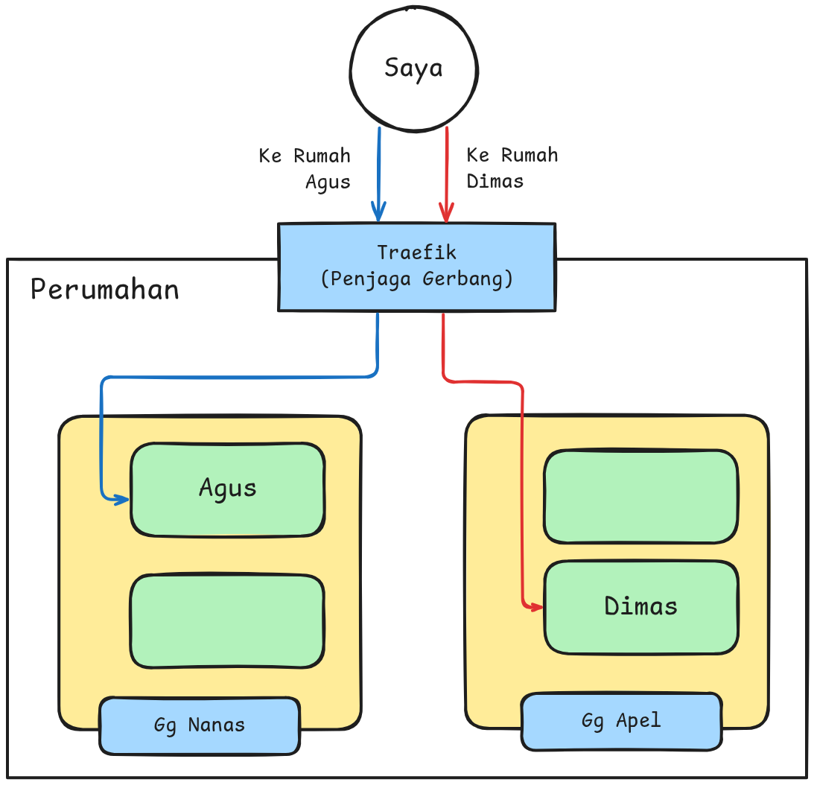
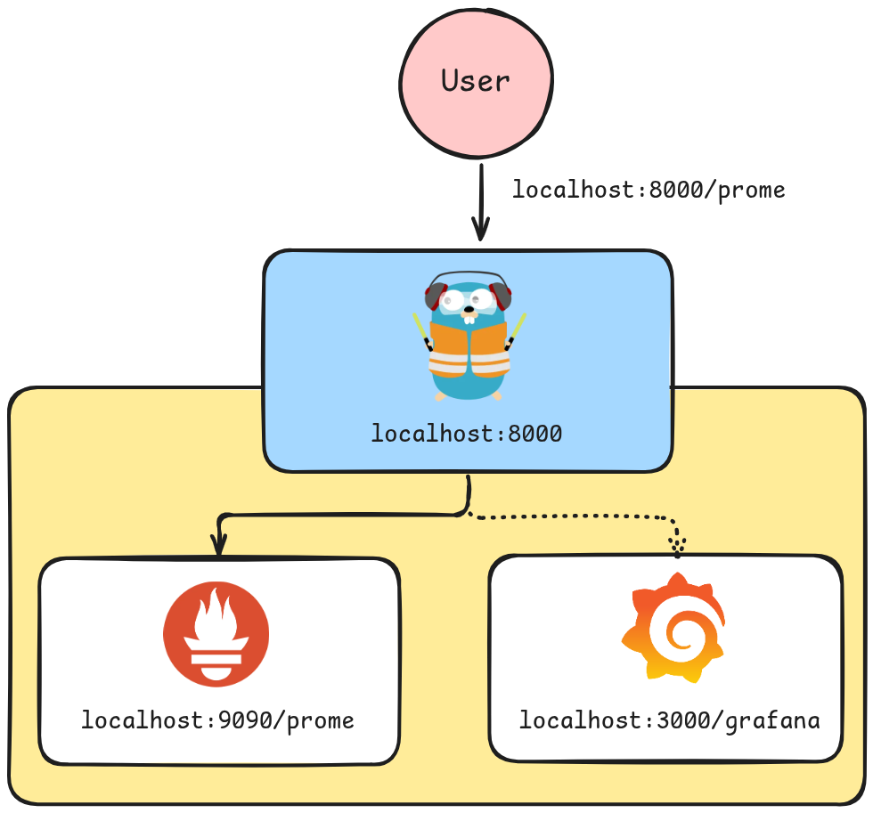
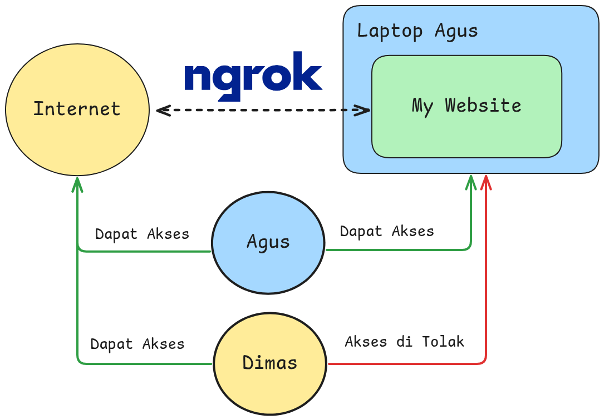
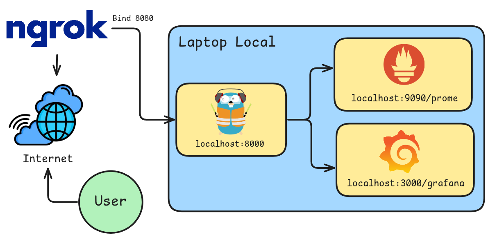
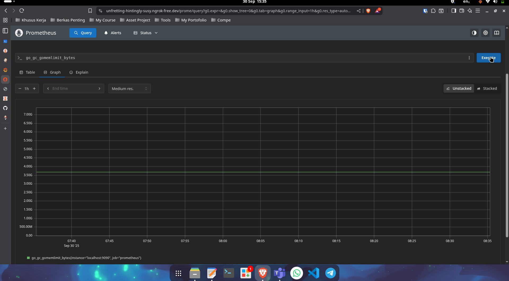

Hai sobat semua, kalian pasti pernah mengalami dalam melakukan homelab di local VM kalian, terkadang ingin di pamerkan pada teman kalian yang lain kan? Nah ini dia solusi akan hal tersebut, kalian bisa menggunakan dua tools di bawah ini agar kalian bisa share project kalian serta pamerin ke teman, bahwa "Saya pernah buat project A, B dan lain sebagai nya", Langsung saja gas ke penjelasan awal dulu yaa... 

## Apa itu Traefik?
Jadi, tools pertama yang kalian butuhkan adalah Traefik, Traefik sendiri itu salah satu tools yang dipakai untuk reverse proxy, load  balancer serta api gateway. Mudahnya dia ini seperti **"Penjaga Gerbang"** jadi, contoh nya: saya ingin ke rumah Dimas, nah si Traefik ini akan memberikan alamat lengkap si Dimas, misal di gang apel no 12. Jadi tugas nya untuk mengarahkan ke tujuan apliaksi.



Untuk contoh teknis nya adalah misal saya ingin ke service **"Prometheus"** maka saya tinggal atur path url dengan **/prome** maka si Trafik akan mengarahkan ke service Prometheus yang ada di port 9090, jadi saya tinggal akses **"localhost"** lalu port dari Traefik, misal contoh di 8000, jadi full path nya seperti ini **http://localhost:8000/prome**.





Tentu, saya akan jelaskan tentang Traefik dan Ngrok, termasuk keuntungan dan kekurangannya.

---

## Traefik

**Traefik** adalah *reverse proxy* dan *load balancer* modern yang dirancang untuk mendeploy *microservices* dengan mudah. Traefik mendapatkan konfigurasinya secara otomatis dan dinamis dari berbagai *provider* (seperti Docker, Kubernetes, dan lain-lain) dengan memindai konfigurasi (seperti *labels* pada Docker Compose yang sudah Anda lihat) secara *real-time*.

### **Keuntungan Traefik**

| Keuntungan | Penjelasan |
| :--- | :--- |
| **Konfigurasi Otomatis (Auto-discovery)** | Tidak perlu me-*restart* Traefik setiap kali Anda menambahkan atau menghapus *container*. Ia secara otomatis mendeteksi *service* baru melalui *provider* seperti Docker *label*. |
| **Sertifikat SSL Otomatis** | Traefik memiliki integrasi **Let's Encrypt** bawaan, memungkinkan Traefik mendapatkan dan memperbarui sertifikat SSL/TLS secara otomatis untuk domain Anda. |
| **Sangat Cocok untuk Microservices** | Desainnya dinamis dan terintegrasi erat dengan *container orchestrators* (Docker, Swarm, Kubernetes), menjadikannya ideal untuk lingkungan yang terus berubah. |
| **Dashboard API & Web** | Menyediakan *dashboard* visual yang rapi untuk memonitor semua *router*, *service*, dan *middleware* yang sedang berjalan. |
| **Middleware Fleksibel** | Mudah menambahkan fungsi tambahan seperti *rate limiting*, *basic authentication*, *header manipulation*, dan *strip prefix* (seperti yang Anda lihat pada konfigurasi Grafana/Prometheus). |

### **Kekurangan Traefik**

| Kekurangan | Penjelasan |
| :--- | :--- |
| **Kurva Pembelajaran Awal** | Konsep *router*, *service*, *middleware*, dan *entrypoint* bisa membingungkan bagi pemula, terutama bagi yang terbiasa dengan konfigurasi *static* Nginx. |
| **Konfigurasi TLS Awal yang Kompleks** | Walaupun otomatis, penyiapan awal untuk Let's Encrypt, terutama dengan *DNS Challenge*, memerlukan penyesuaian yang rumit. |
| **Ketergantungan Provider** | Traefik sangat mengandalkan *metadata* dari *provider* (misalnya *labels* pada Docker). Jika *metadata* salah, *service* tidak akan berfungsi. |

---

## Apa itu Ngrok?

jadi untuk Ngrok ini adalah salah satu tools untuk *reverse proxy*, *Tunneling* serta *Api Gateway*, Inti nya Ngrok itu bisa membuat service/tools di local komputer kita menjadi public, dan bisa di akses dari internet. Ngrok untuk free tier, itu hanya bisa membuat 1 URL public yang nantinya bisa kita gunakan untuk mengekspose 1 service aja, contoh nya itu seperti pada ilustrasi berikut ini.



Jadi orang selain Agus (pemilik Laptop) itu hanya bisa akses website yang ada di laptop Agus melalui internet, nah nantinya dari internet itu akan mengarahkan ke Ngrok URL public yang sudah di setting, baru orang lain bisa akses, sedangkan kalau Agus, karena dia pemilik laptop nya, dia bebas bisa akses dari Internet maupun langsung di laptop nya sendiri.


### **Keuntungan Ngrok**

| Keuntungan | Penjelasan |
| :--- | :--- |
| **Eksposur Lokal Instan** | Paling cepat dan mudah untuk mengekspos *web service* lokal ke internet tanpa harus mengkonfigurasi *port forwarding* di *router* Anda. |
| **Ideal untuk Pengujian/Demo** | Sangat berguna untuk menguji *webhook* (misalnya dari PayPal, Stripe, dll.) atau mendemonstrasikan aplikasi yang sedang dikembangkan kepada klien atau rekan kerja. |
| **Tunneling yang Aman (SSL)** | Secara *default*, Ngrok menyediakan terowongan yang dienkripsi TLS (HTTPS), meskipun *service* lokal Anda mungkin berjalan di HTTP. |
| **Inspeksi Lalu Lintas** | Ngrok menyediakan *web UI* lokal yang memungkinkan Anda menginspeksi semua permintaan HTTP yang masuk dan keluar melalui *tunnel* tersebut, berguna untuk *debugging*. |

### **Kekurangan Ngrok**

| Kekurangan | Penjelasan |
| :--- | :--- |
| **URL Sementara (Gratis)** | Versi gratis Ngrok akan memberikan URL publik yang **berubah** setiap kali Anda me-*restart* *tunnel*-nya. |
| **Batasan Koneksi & Bandwidth (Gratis)** | Versi gratis memiliki batasan *rate* dan batas waktu *session* yang cukup ketat, tidak cocok untuk penggunaan produksi berkelanjutan. |
| **Bukan untuk Produksi Jangka Panjang** | Meskipun ada versi berbayar dengan *custom domain*, Ngrok biasanya **tidak digunakan** sebagai *reverse proxy* utama untuk *service* produksi yang *highly-available* karena merupakan layanan eksternal. |
| **Ketergantungan Penuh pada Layanan Pihak Ketiga** | Jika layanan *cloud* Ngrok sedang *down* atau mengalami masalah, *service* lokal Anda tidak dapat diakses dari luar. |


## Topologi Labs


## Requirements Resource
- RAM minimum: 9 GB (Recommend Used 16 GB)
- CPU: 4
- Storage: 35 GB


## Implementasi

### 1. Configuration Prometheus
Pada case kali ini saya akan mencoba pakai sample Prometheus yang di deploy di container docker, Berikut langkah konfigurasi nya.
- Buat file `docker-compose.yml` dengan command berikut.
  ```bash
  nano docker-compose.yml
  ```
  ---

- Copy konfigurasi berikut ini agar Prometheus
  ```yaml
  services:
    prometheus:
      image: prom/prometheus:latest
      container_name: prometheus
      ports:
        - "9090:9090"
      command:
        - '--config.file=/etc/prometheus/prometheus.yml'
        - '--web.route-prefix=/'
      volumes:
        - ./prome/prometheus.yaml:/etc/prometheus/prometheus.yml:ro
      labels:
        - "traefik.enable=true"
        - "traefik.http.routers.prom.rule=PathPrefix(`/prome`)"
        - "traefik.http.routers.prom.entrypoints=web"
        - "traefik.http.middlewares.prom-strip.stripprefix.prefixes=/prome"
        - "traefik.http.routers.prom.middlewares=prom-strip"
        - "traefik.http.services.prom.loadbalancer.server.port=9090"
      networks:
        - monitoring
  ```
  ---
#### Penjelasan Konfigurasi


| Bagian | Baris Konfigurasi | Penjelasan Singkat | Detail Teknis |
| :--- | :--- | :--- | :--- |
| **`command`** | `--config.file=/etc/prometheus/prometheus.yml` | Mengarahkan Prometheus untuk menggunakan berkas konfigurasi spesifik. | Memberi tahu Prometheus di mana ia harus mencari berkas konfigurasinya (**`prometheus.yml`**) di dalam *container*. |
| | `--web.route-prefix=/` | Menentukan awalan jalur URL untuk antarmuka web Prometheus. | Ini mengatur bahwa antarmuka web Prometheus berada di *root path* (**`/`**) *service*-nya. (Catatan: Traefik akan mengubah awalan ini, lihat bagian `labels`). |
| **`volumes`** | `./prome/prometheus.yaml:/etc/prometheus/prometheus.yml:ro` | **Mounting** berkas konfigurasi lokal ke dalam *container*. | Berkas konfigurasi **`prometheus.yaml`** yang ada di direktori lokal Anda (`./prome/`) akan disalin ke lokasi konfigurasi di dalam *container*. **`:ro`** (Read-Only) memastikan Prometheus tidak dapat mengubah berkas tersebut. |
| **`labels`** | `"traefik.enable=true"` | **Mengaktifkan** integrasi Traefik untuk *service* ini. | Traefik akan memindai label ini dan memproses semua konfigurasi Traefik lainnya untuk *container* ini. |
| | `traefik.http.routers.prom.rule=PathPrefix("/prome")` | **Definisi *Router*:** Menentukan aturan *routing* berdasarkan URL. | Setiap permintaan HTTP yang diawali dengan jalur **`/prome`** (misalnya `http://alamat-server/prome/`) akan ditangani oleh *router* ini. |
| | `"traefik.http.routers.prom.entrypoints=web"` | Menentukan *entrypoint* (port/protokol) yang digunakan *router*. | *Router* ini akan mendengarkan koneksi yang masuk melalui *entrypoint* bernama **`web`** (biasanya adalah port 80/HTTP). |
| | `"traefik.http.middlewares.prom-strip.stripprefix.prefixes=/prome"` | **Definisi *Middleware*:** Membuat *middleware* untuk menghapus awalan jalur. | Membuat *middleware* bernama **`prom-strip`** yang akan menghapus awalan **`/prome`** dari URL sebelum permintaannya diteruskan ke Prometheus. |
| | `"traefik.http.routers.prom.middlewares=prom-strip"` | Menerapkan *middleware* ke *router*. | *Router* `prom` akan menggunakan *middleware* `prom-strip`. Jadi, saat Anda mengakses `http://.../prome/graph`, Traefik akan menghapus `/prome` dan meneruskan `http://.../graph` ke Prometheus. |
| | `"traefik.http.services.prom.loadbalancer.server.port=9090"` | **Definisi *Service*:** Menentukan port tujuan di dalam *container*. | Memberi tahu Traefik bahwa *service* Prometheus berjalan di **port 9090** di dalam *container*, dan Traefik harus meneruskan semua permintaan ke port ini. |

- Buat konfigurasi file buat service Prometheus nya, untuk case ini saya spesifik di path `./prome/prometheus.yaml`
  ```bash
  mkdir prome
  cd prome
  nano prometheus.yaml
  ```
  ---
- Paste konfigurasi berikut untuk sebagai target yang nantinya akan diguanakan prometheus untuk register exporter nya. Untuk contoh ini masih default dari prometheus, belum integrate ke exporter lain.
  ```yaml
  global:
    scrape_interval: 15s

  scrape_configs:
    - job_name: "prometheus"
      static_configs:
        - targets: ["localhost:9090"]
  ```
  ---
### 2. Configuration Grafana
- Buka file `docker-compose.yml` nya lagi.
  ```bash
  nano docker-compose.yml
  ```
  ---
- Tambahkan konfigurasi Grafana berikut ini
  ```yaml
  services:
    grafana:
      image: grafana/grafana:latest
      container_name: grafana
      ports:
        - "3000:3000"
      environment:
        - GF_SERVER_ROOT_URL=http://172.1.1.12:3000/grafana/
        - GF_SERVER_SERVE_FROM_SUB_PATH=true
      volumes:
        - grafana-storage:/var/lib/grafana
      labels:
        - "traefik.enable=true"
        - "traefik.http.routers.grafana.rule=PathPrefix(`/grafana`)"
        - "traefik.http.services.grafana.loadbalancer.server.port=3000"
        - "traefik.http.routers.grafana.entrypoints=web"
      networks:
        - monitoring
  ```
  ---
#### Penjelasan Konfigurasi


| Bagian | Baris Konfigurasi | Penjelasan Singkat | Detail Teknis |
| :--- | :--- | :--- | :--- |
| **`environment`** | `GF_SERVER_ROOT_URL=http://172.1.1.12:3000/grafana/` | Menentukan URL dasar lengkap untuk Grafana. | Ini memberi tahu Grafana bagaimana ia harus membuat tautan internal dan mengarahkan pengguna. URL-nya mencakup jalur sub-direktori **`/grafana/`** dan port internal (`3000`). |
| | `GF_SERVER_SERVE_FROM_SUB_PATH=true` | Mengizinkan Grafana diakses melalui *sub-path*. | **Wajib** diatur ketika Grafana diakses di belakang *reverse proxy* (seperti Traefik) dengan jalur awalan (misalnya `/grafana`). Ini memungkinkan Grafana menangani aset (CSS, JS) dengan benar. |
| **`volumes`** | `grafana-storage:/var/lib/grafana` | Menyimpan data Grafana secara persisten. | Menghubungkan *Docker Volume* bernama **`grafana-storage`** ke direktori tempat Grafana menyimpan *database*, *dashboard*, dan data lainnya. Ini memastikan data tidak hilang ketika *container* di-*restart*. |
| **`labels`** | `"traefik.enable=true"` | **Mengaktifkan** Traefik untuk *service* ini. | Traefik akan memproses label lain untuk mengkonfigurasi *routing* Grafana. |
| | `"traefik.http.routers.grafana.rule=PathPrefix(\`/grafana\`)"` | **Definisi *Router*:** Menentukan aturan *routing* berdasarkan URL. | Setiap permintaan HTTP yang diawali dengan jalur **`/grafana`** akan ditangkap dan diarahkan ke *service* Grafana. |
| | `"traefik.http.services.grafana.loadbalancer.server.port=3000"` | **Definisi *Service*:** Menentukan port Grafana di dalam *container*. | Traefik akan meneruskan lalu lintas yang masuk ke **port 3000** di dalam *container* Grafana. |
| | `"traefik.http.routers.grafana.entrypoints=web"` | Menentukan *entrypoint* (port/protokol) yang digunakan *router*. | *Router* ini akan mendengarkan koneksi yang masuk melalui *entrypoint* bernama **`web`** (biasanya adalah port HTTP 80 atau 8080). |


### 3. Configuration Traefik
- Buka file `docker-compose.yml` nya lagi.
  ```bash
  nano docker-compose.yml
  ```
  ---
- Tambahkan konfigurasi Traefik berikut ini beserta network dan storage untuk grafana nya.
  ```yaml
  services:
  traefik:
    image: traefik:v3.1
    container_name: traefik
    command:
      - "--entrypoints.web.address=:9000"
      - "--providers.docker=true"
      - "--api.dashboard=true"
      - "--log.level=info"
      - "--api.insecure=true"
    ports:
      - "9000:9000"        # akses utama Prome & Grafana
    volumes:
      - /var/run/docker.sock:/var/run/docker.sock
    networks:
      - monitoring
  
  volumes:
    grafana-storage:

  networks:
    monitoring:
      driver: bridge
  ```
  ---

- Create container 3 service tadi dengan command berikut ini.
  ```bash
  docker-compose up -d
  ```
  ---
- Tunggu beberapa saat, cek log setiap service nya jika ada yg error, pakai command. (Optional jika container Exited)
  ```bash
  docker logs {SERVICE_NAME}

  # exp:
  docker logs prome
  docker logs traefik
  docker logs grafana
  ```
  ---

#### Penjelasan Konfigurasi Docker-Compose

| Bagian | Baris Konfigurasi | Penjelasan Singkat | Detail Teknis |
| :--- | :--- | :--- | :--- |
| **`command`** | `--entrypoints.web.address=:9000` | Mendefinisikan *entrypoint* HTTP yang akan didengarkan oleh Traefik. | Membuat *entrypoint* bernama **`web`** yang akan mendengarkan koneksi pada port **`9000`** di dalam *container* Traefik. *Entrypoint* ini digunakan oleh *router* Prometheus dan Grafana sebelumnya. |
| | `--providers.docker=true` | Mengaktifkan *provider* Docker untuk penemuan konfigurasi otomatis. | Traefik akan memantau *socket* Docker dan secara otomatis membaca konfigurasi (`labels`) dari setiap *container* yang berjalan, seperti Prometheus dan Grafana, tanpa perlu konfigurasi manual. |
| | `--api.dashboard=true` | Mengaktifkan fitur API dan *dashboard* Traefik. | Memungkinkan Traefik mengekspos API-nya dan menyajikan **Dashboard Traefik** yang interaktif untuk memonitor *router* dan *service*. |
| | `--log.level=info` | Menentukan tingkat detail *logging* (pencatatan aktivitas). | Traefik akan mencatat semua pesan pada tingkat **`INFO`** dan yang lebih tinggi (*warnings*, *errors*). Ini berguna untuk pemecahan masalah dan pemantauan status. |
| | `--api.insecure=true` | Mengizinkan akses tidak aman (tanpa autentikasi) ke API dan Dashboard. | **Hanya direkomendasikan untuk lingkungan lokal atau pengembangan.** Ini membuat *dashboard* Traefik dapat diakses tanpa kredensial di *entrypoint* yang sama. |
| **`ports`** | `9000:9000` | Membuka dan memetakan port Traefik ke *host* (komputer utama). | Memetakan port **`9000`** dari *container* ke port **`9000`** pada mesin *host*. Ini memungkinkan akses eksternal ke Traefik dan *service* yang melewatinya (Prome & Grafana). |
| **`volumes`** | `/var/run/docker.sock:/var/run/docker.sock` | Menyediakan akses ke Docker *socket* *host*. | **Wajib** agar `--providers.docker=true` dapat berfungsi. Traefik menggunakan *socket* ini untuk berkomunikasi dengan *daemon* Docker dan membaca label konfigurasi dari *container* lain (Prometheus dan Grafana). |


### 4. Configuration Ngrok
- Buat account di Ngrok jika belum punya, lalu login dengan account tersebut.
- Open VM atau Homelab kalian yang ingn di expose ke public
- Kemudian add repository Ngrok, lalu Install tools Ngrok. ***Notes: Untuk installasi ngrok, kalian bisa sesuaikan dengan distro masing - masing, sebagai contoh saya di distro Linux Ubuntu***
  ```bash
  curl -sSL https://ngrok-agent.s3.amazonaws.com/ngrok.asc \
      | sudo tee /etc/apt/trusted.gpg.d/ngrok.asc >/dev/null \
      && echo "deb https://ngrok-agent.s3.amazonaws.com bookworm main" \
      | sudo tee /etc/apt/sources.list.d/ngrok.list \
      && sudo apt update \
      && sudo apt install ngrok jq -y
  ```
  ---

- Add authToken yang di berikan dari Ngrok, scroll sedikit ke bawah pada dashboard Ngrok nya, yangg terdapat command seperti berikut.
  ```bash
  ngrok config add-authtoken {AUTH_TOKEN_NGROK}
  ```
  ---
- Selanjutnya, buat Ngrok berjalan di background, agar kita tidak perlu jalankan manual **`ngrok http {PORT}`**, 
  ```bash
  nano /etc/systemd/system/ngrok.service
  ```
- Paste configurasi berikut ini, pastikan pada *{PORT_TRAEFIK}* di `  ExecStart=/usr/local/bin/ngrok http {PORT_TRAEFIK} --log=stdout`, sesuai dengan port Traefik yang nanti akan di deploy, example saya pakai port `8000`.
  ```bash
  [Unit]
  Description=Ngrok Tunnel
  After=network.target

  [Service]
  ExecStart=/usr/local/bin/ngrok http 9000 --log=stdout
  Restart=on-failure
  User=root
  StandardOutput=file:/var/log/ngrok.log
  StandardError=file:/var/log/ngrok_error.log

  [Install]
  WantedBy=multi-user.target
  ```
  ---
- Lalu reload daemon agar config service ngrok bisa di baca system dan dapat di jalankan, jalankan perintah berikut.
  ```bash
  sudo systemctl daemon-reload
  sudo systemctl start ngrok
  sudo systemctl enable ngrok
  ```
 ---


### Validasi Akses
validasi akses Service Prometheus dan Grafana dari browser laptop dengan **`https://{NGROK_URL}/prome`** dan **`https://{NGROK_URL}/grafana`

#### Prometheus


#### Grafana


