Halo sobat Cloud! Balik lagi sama gue, Najwan. Kali ini kita bakal bahas sesuatu yang **gokil** banget di dunia AWS. Pernah gak sih kalian mikir, gimana caranya nge-handle ribuan request per detik tanpa bikin server meledak atau database *timeout*? Jawabannya adalah **Decoupled Architecture** alias arsitektur yang gak saling nempel banget.

Di lab kali ini, kita bakal mainan sama **ALB (Application Load Balancer)**, **Lambda**, **SQS (Simple Queue Service)**, dan **DynamoDB**. Intinya, kita mau bikin sistem yang *scalable* dan *reliable*. Jadi kalau ada lonjakan trafik, sistem kita tetep santuy karena ada antrian (SQS) yang nampung beban sebelum diproses ke database.

Gas langsung aja kita bedah arsitekturnya!

# Pembahasan Arsitektur

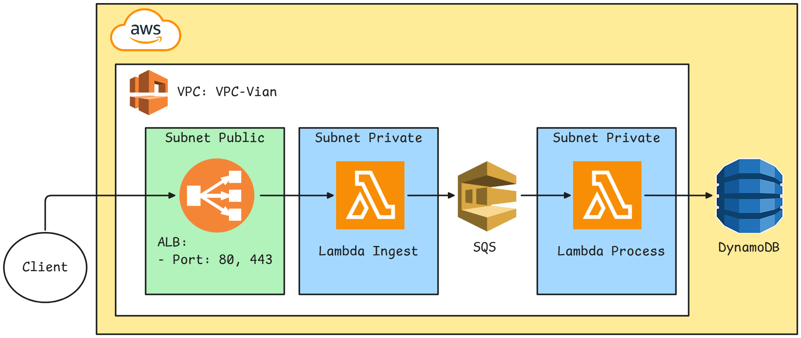
---

Konsepnya sederhana tapi *powerful*. Kita gak mau user nunggu lama cuma buat nunggu proses database selesai. Jadi kita pake metode **Asinkronus**.

**Alur Datanya kayak gini:**
1. **User** ngirim request HTTP (misal: menambah barang) ke **ALB**.
2. **ALB** nerusin request ke **Lambda Ingest**.
3. **Lambda Ingest** gak langsung nulis ke DB, tapi dia cuma "nitip" pesan ke **SQS**. Abis itu dia langsung bilang "Oke, diterima" ke User. Cepet kan?
4. **SQS** nampung pesan-pesan itu dalam antrian.
5. **Lambda Process** (yang dipicu oleh SQS) bakal ngambil pesan dari antrian dan memprosesnya (misal: simpen ke **DynamoDB**).

Dengan cara ini, frontend user bakal ngerasa aplikasinya ngebut banget, padahal di belakang layar prosesnya lagi ngantri dengan rapih.


# 🚀 Langkah Implementasi

Biar gak bingung, kita bagi jadi beberapa *part* ya. Siapin kopi kalian, *let's dive in!*

### 1. persyaratan awal
- VPC sudah ada dengan configurasi
    - 4 Subnet (Public dan Private masing - masing 2)
    - Internet Gateway
    - RTB untuk subnet Public dan RTB untuk masing - masing subnet Private 
- SG dengan Inbound Port
    - HTTP: 80
    - HTTPS: 443

### 2. Siapin Database (DynamoDB)
Pertama, kita butuh tempat buat nyimpen data akhirnya. Kita pake DynamoDB karena dia *serverless* dan *fast*.

*   Buka console DynamoDB, klik **Create table**.
*   Isi nama tabel dan Partition key-nya sesuai kebutuhan. berikut contoh yang saya pakai, setelah itu click `Create`
    * Partition Key: `order_id`
    * Sort Key: `item`


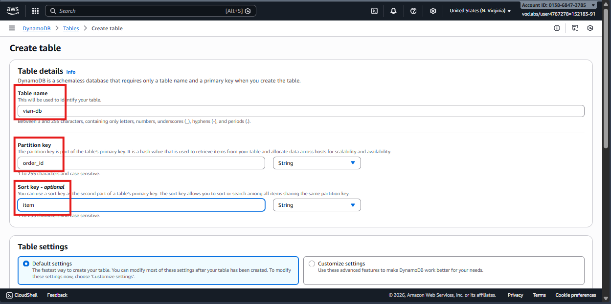
---

### 3. Buat Queue Service (SQS)
Ini dia pahlawan kita, si penampung load data.

*   Masuk ke service SQS, pilih **Create queue**. 

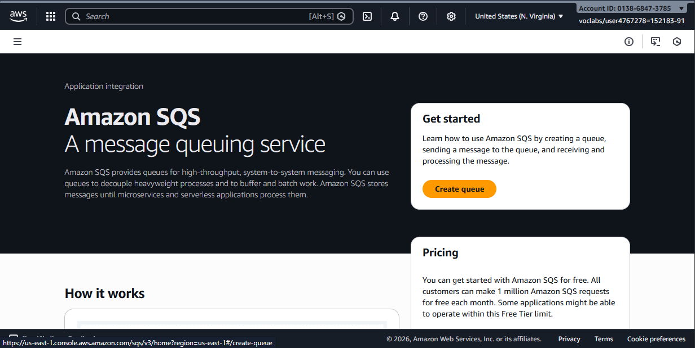
---

* Pilih tipe **Standard** aja biar throughput-nya tinggi dan prosesnya lebih cepat. Lalu fill nama nya, exp `vian-sqs`. lalu klik `Create`.

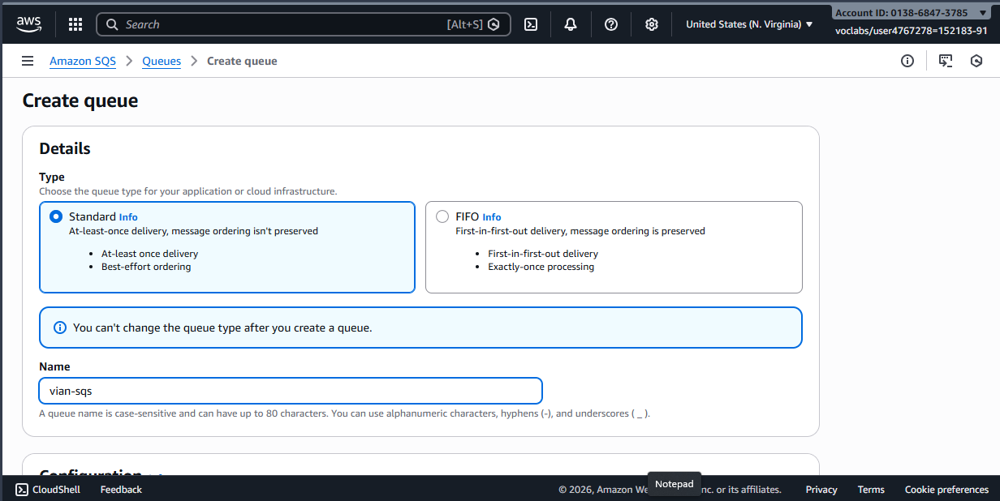
---

* Kemudian simpan link hasil SQS untuk di pakai di Lambda Ingest.

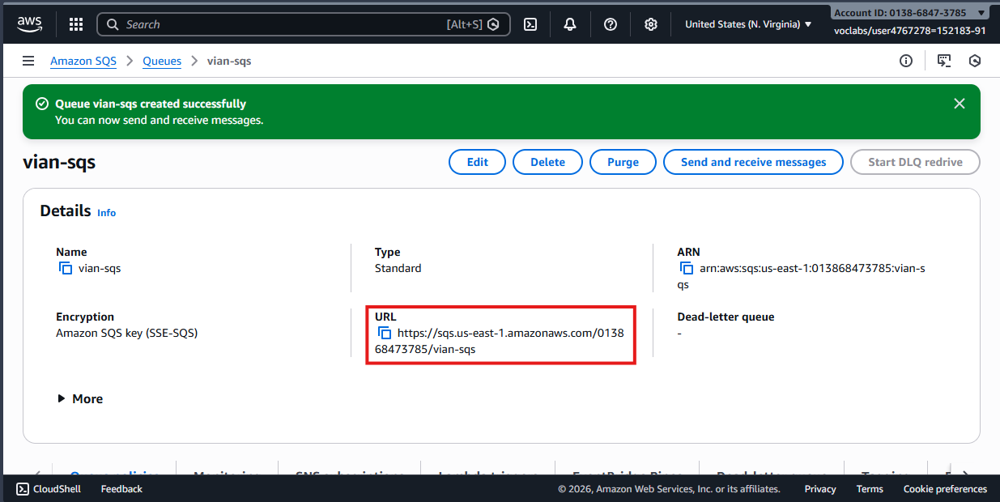
---

### 4. Lambda Ingest
Sekarang kita buat Lambda function pertama, si `IngestFunction`. Tugasnya cuma nerima data dari ALB terus lempar ke SQS.

*   Buat function baru, kasih nama yang kece (misal: `Ingest-vian`).
*   Pilih Runtime Python.

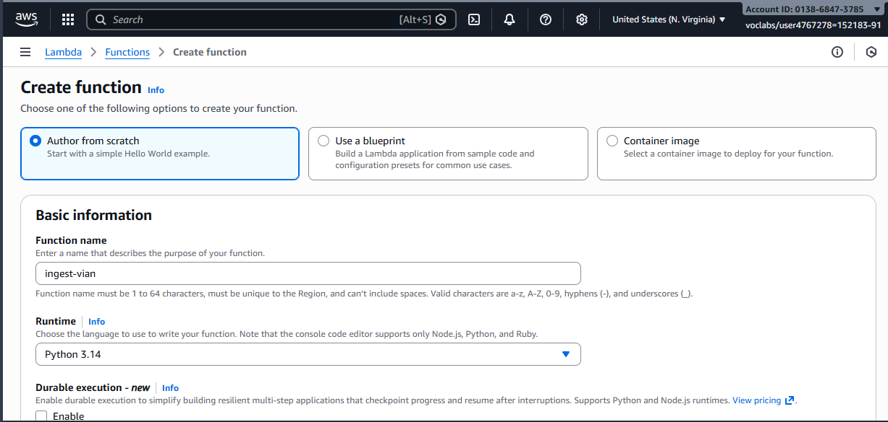
---

*   Pastiin IAM Role-nya punya akses buat **sqs:SendMessage** ke SQS Queue yang udah kita buat. Pada kali ini karena saya pakai AWS Academy, jadi bisa pakai `LabRole`


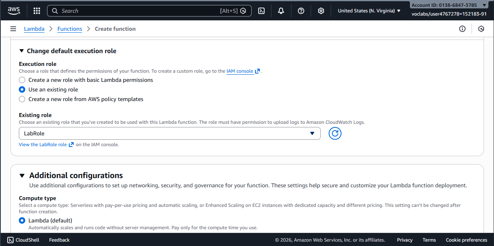
---

* Enable konfigurasi VPC yang akan di pakai di Lammbda Ingest.
* Pilih subnet Private sesuai dengan topologi.

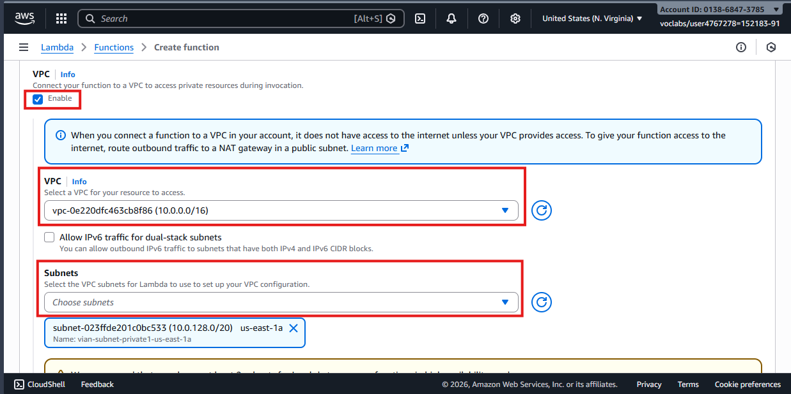
---

* Pilih Security Group yang sudah di buat dengan Inbound port 80 dan 443.

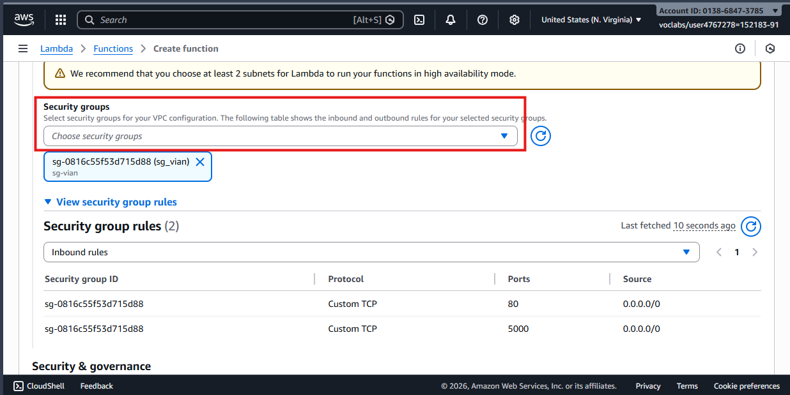
---

*   Berikut adalah script untuk `IngestFunction`. Script ini akan menerima event dari ALB, mengambil body request, dan mengirimkannya sebagai pesan ke SQS.

```python
import json
import boto3
import os

# Inisialisasi client di luar handler agar lebih cepat (Global)
sqs = boto3.client('sqs')
QUEUE_URL = "{PASTE-URL-SQS}"

def lambda_handler(event, context):
    print("EVENT DARI ALB:", json.dumps(event))
    
    path = event.get('path', '/')
    method = event.get('httpMethod', 'UNKNOWN')
    
    # Sesuaikan dengan path yang ada di trigger, exp: /lambda/api
    if path == "/lambda/api" and method == "POST":
        try:
            body_raw = event.get('body', '{}')
            
            sqs.send_message(
                QueueUrl=QUEUE_URL,
                MessageBody=body_raw
            )
            
            return {
                "statusCode": 200,
                "headers": {"Content-Type": "application/json"},
                "body": json.dumps({"status": "Success", "msg": "Data masuk antrean SQS"})
            }
        except Exception as e:
            print(f"CRITICAL ERROR SQS: {str(e)}")
            return {
                "statusCode": 500,
                "body": json.dumps({"error": f"Gagal kirim ke SQS: {str(e)}"})
            }
    
    else:
        return {
            "statusCode": 404,
            "body": json.dumps({"error": f"Path {path} salah"})
        }
```
---

### 5. Target Group
Biar `IngestFunction` bisa diakses dari internet, kita butuh ALB.

*   Buat Target Group baru, pilih target type **Lambda function** dan pilih `IngestFunction` yang sudah dibuat.

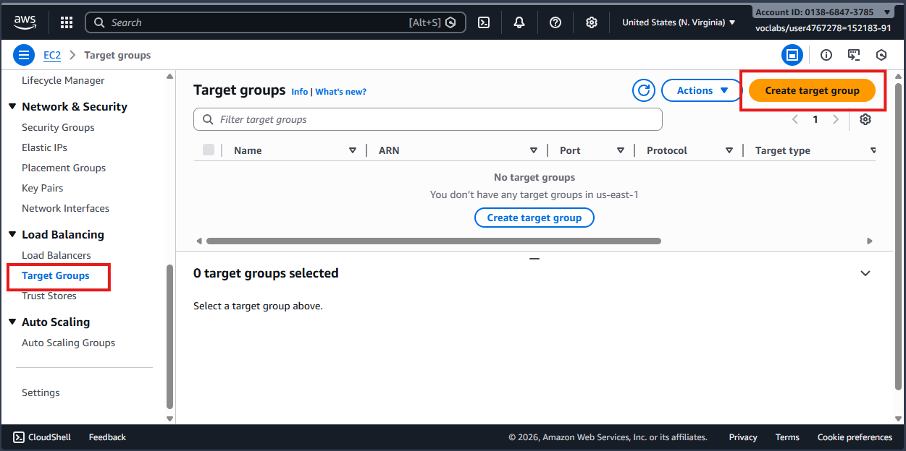
---
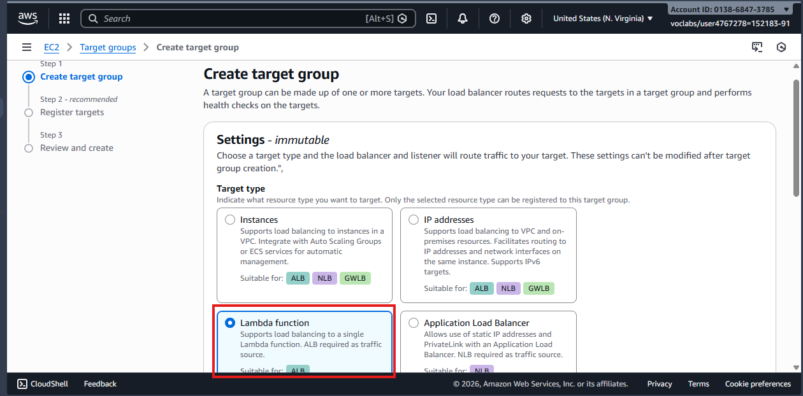
---

### 6. Application Load Balancer (ALB)
*   Buat Application Load Balancer baru.

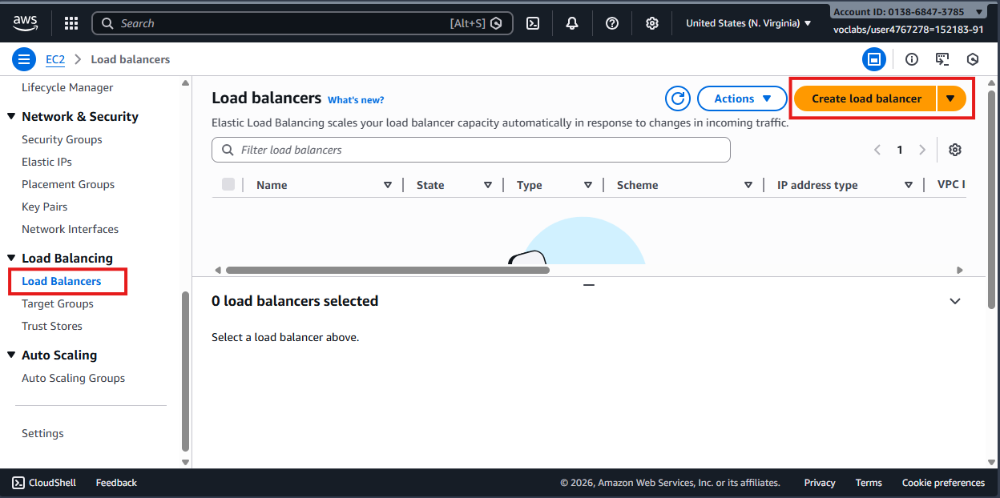
---

*  Pilih tipe load balancer yang `Application Load Balance (ALB)`

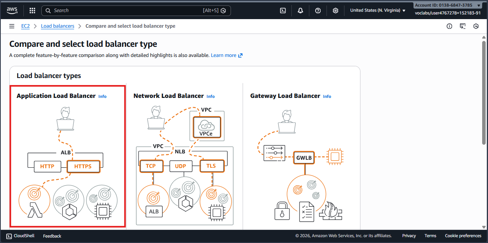
---

* Lalu konfigurasi nama, schema pakai `Internal-facing` kemudian IP address nya `IPv4`

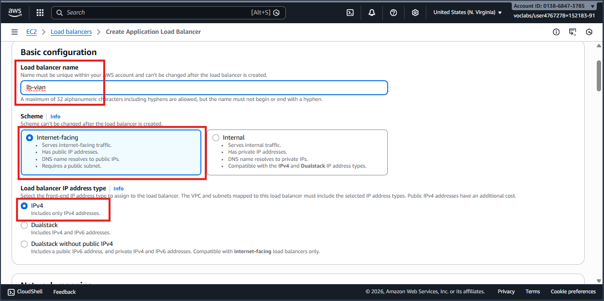
---

* Lalu configure VPC, AZ, dan Subnet
    - VPC: pakai yang sudah di buat sebelumnya
    - Pilih AZ, bisa 1 atau 2, sesuai jumlah AZ yang di buat saat, sebagai contoh saya akan add 2 AZ
    - Lalu arahkan Subnet nya ke `Subnet Public` karena ini akan di akses oleh Client

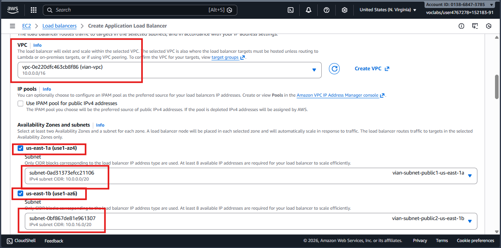
---

* Lalu setting SG dan Listener
     - SG: arahkan ke SQ yang punya Inbound Port 80 dan 443
     - Listener: arahkan ke `HTTP` dan ke port `80`


---

* Kemudian Pilih Target group yang sudah di buat sebelumnya, lalu klik `Create`

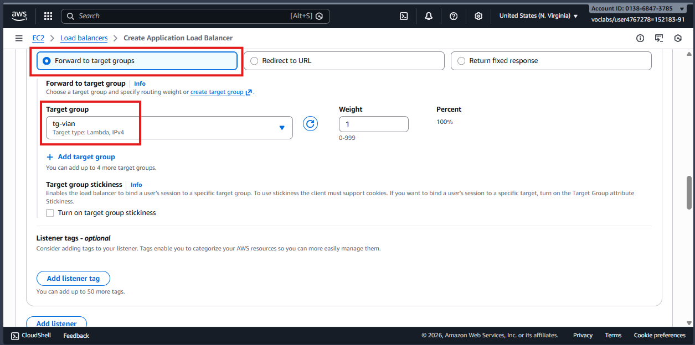
---
### 7. Set Trigger Lambda 
*   Jangan lupa setting **Trigger** di `IngestFunction` agar dia tau kalau dia dipanggil sama ALB. klik `Add Trigger`

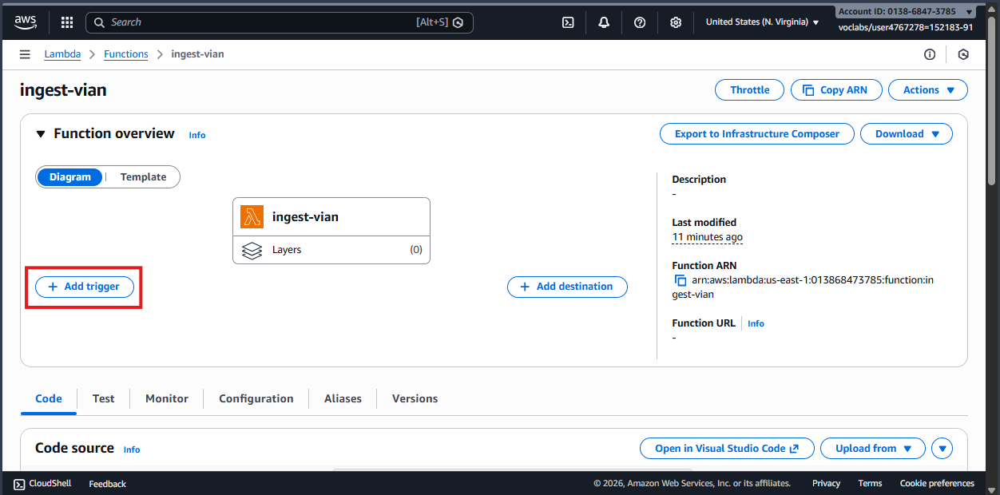
---

* Search `ALB`

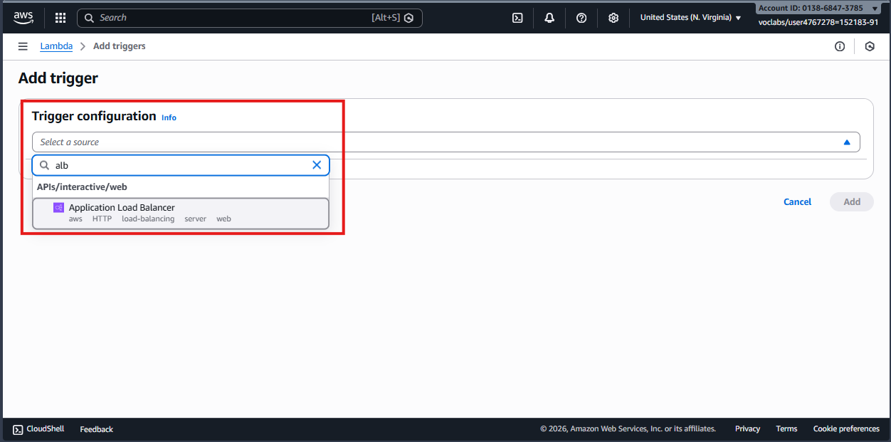
---
* Pada Bagian `Application Load Balance` pilih ALB yang sudah kita buat
* Listener arahkan ke `HTTP:80`
* Path nya pakai `/lambda/api/`. Ini bisa kalian atur bebas, tapi sesuaikan juga pada code lambda `IngestFunction` kalian, agar sesuai.

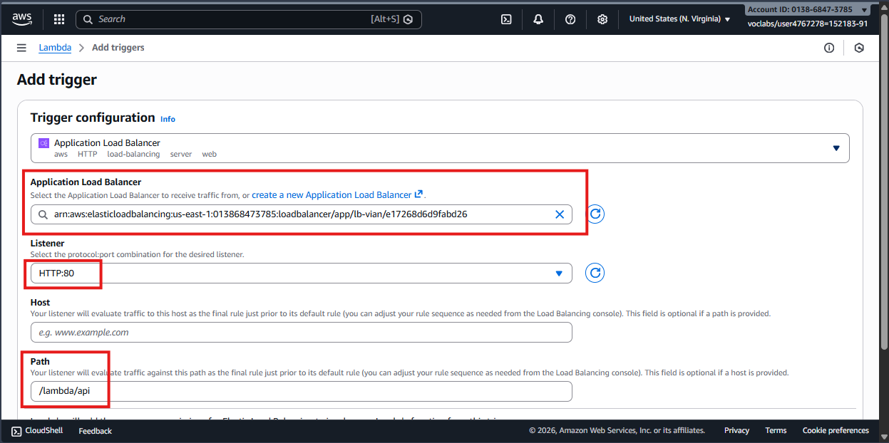
---

### 8. Lambda Process 
Nah, ini function kedua, si `ProcessFunction`. Tugasnya ngambil data dari SQS terus masukin ke DynamoDB.

*   Buat function baru (misal: `ProcessFunction`). Samakan dengan `IngestFunction`.
*   Pilih Runtime Python.

*   Pilih IAM Role yang ada permission **sqs:ReceiveMessage**, **sqs:DeleteMessage**, dan **dynamodb:PutItem**. Ini penting agar Lambda bisa baca dari SQS, hapus pesan setelah selesai, dan nulis ke DynamoDB. di sini saya pakai role `LabRole`

*   Berikut adalah script untuk `ProcessFunction`. Script ini akan dipicu oleh SQS, mem-parsing setiap pesan, dan menyimpannya ke tabel DynamoDB.

```python
import json
import boto3
import os

dynamodb = boto3.resource('dynamodb')
TABLE_NAME = os.environ.get('TABLE_NAME')
table = dynamodb.Table(TABLE_NAME)

def lambda_handler(event, context):
    # SQS mengirimkan data dalam bentuk list 'Records'
    for record in event['Records']:
        try:
            # 1. Parse body dari pesan SQS
            payload = json.loads(record['body'])
            
            # 2. Simpan ke DynamoDB
            # Pastikan payload memiliki 'Partition Key' yang sesuai dengan tabel Anda
            table.put_item(Item=payload)
            
            print(f"Berhasil memproses pesan ID: {record['messageId']}")
            
        except Exception as e:
            print(f"Gagal memproses record {record['messageId']}: {str(e)}")
            # Jika return error, SQS akan mencoba mengirim ulang pesan ini (Retry)
            raise e 

    return {
        'statusCode': 200,
        'body': json.dumps('Proses SQS ke DynamoDB selesai')
    }
```
---

*   **Set Trigger SQS:** Setting **Trigger**-nya arahin ke SQS yang udah kita buat. Jadi setiap ada pesan masuk ke SQS, Lambda ini bakal otomatis jalan.

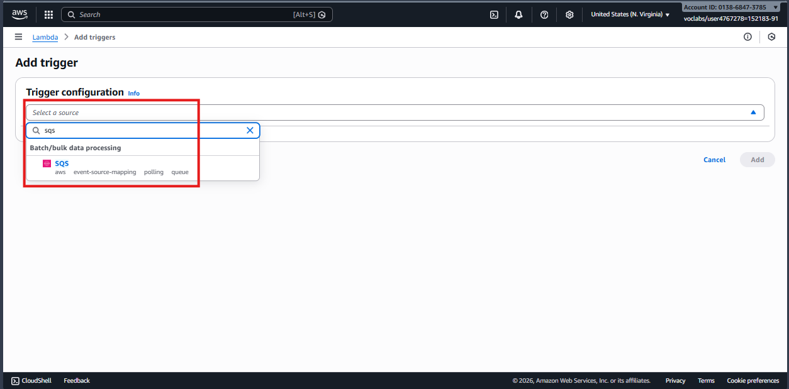
---
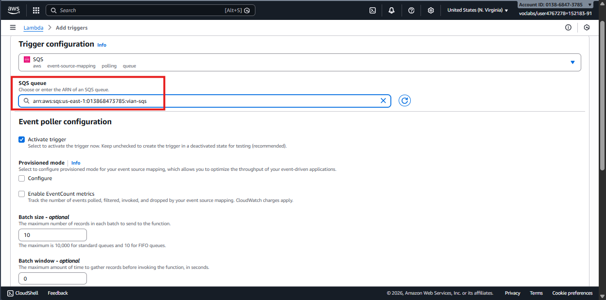
---

## Tabel Konfigurasi Penting

Biar gak ada yang kelewat, cek tabel konfigurasi ini ya:

| Komponen | Konfigurasi | Penjelasan |
| :--- | :--- | :--- |
| **IAM Role Lambda** | `LabRole` | Role ini buat Lambda bisa kirim ke SQS dan tulis ke DB. (Best practice: pake *least privilege* ya!) |
| **SQS Visibility Timeout** | > Lambda Timeout | Durasi pesan "hilang" dari antrian saat diproses. Harus lebih lama dari durasi eksekusi Lambda Consumer. |
| **Lambda Trigger** | Batch Size | Jumlah pesan yang diambil Lambda Consumer sekali jalan. Default 10, bisa di-tuning sesuai kebutuhan. |
| **ALB Listener** | Port 80 (HTTP) | Forwarding rule ke Target Group Lambda Ingest. |

---

### ✅ Validasi & Testing

Saatnya pembuktian! Apakah sistem kita jalan mulus?

1.  **Hit API pake Postman**
    Kirim request POST ke DNS name ALB kalian dengan path `/lambda/api`. Body-nya berisi data JSON yang mau disimpan.
    - Klik pada url atas, pastekan URL hasil ALB kalian, kemudian tambahin juga path nya `/lambda/api`.
    - Lalu kalian Ubah Method nya jadi `POST` seperti pada gambar berikut ini.
    - lalu klik `body` untuk menambahkan data, misal saya pakai data berikut ini, lalu klik `Send`.
    ```json
    {"order_id": "123", "item":"Kopi Susu", "qty": 2}
    ```

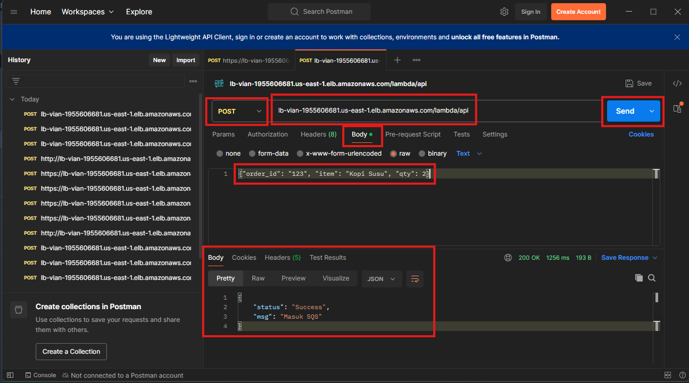
---
2.  **Cek DynamoDB**
    Dan... *voila*! Datanya udah masuk ke tabel DynamoDB dengan rapi.

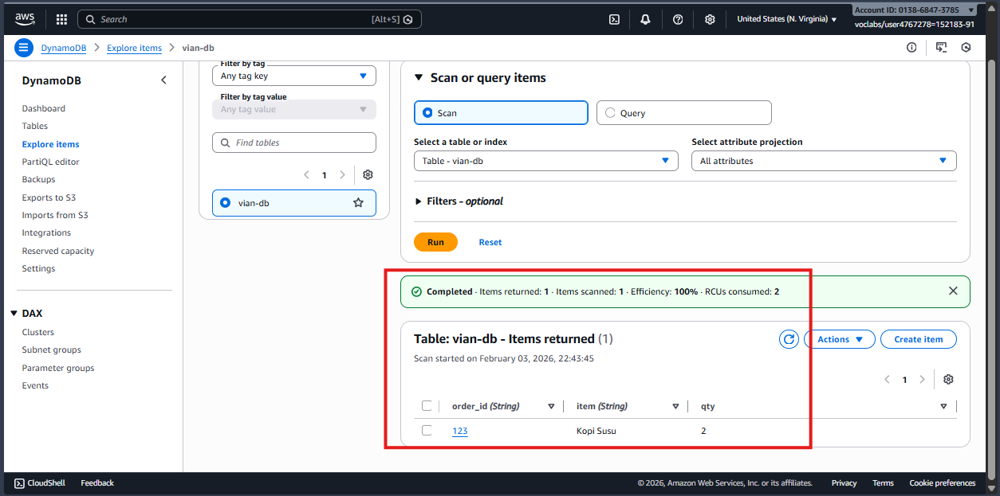
---
</br>
Gimana? Seru kan mainan arsitektur *serverless*? Dengan pola ini, aplikasi kalian bakal jauh lebih *resilient* dan siap nge-handle trafik badai sekalipun.


Sampai jumpa di artikel berikutnya, *keep learning and keep building!* ☁️🚀
